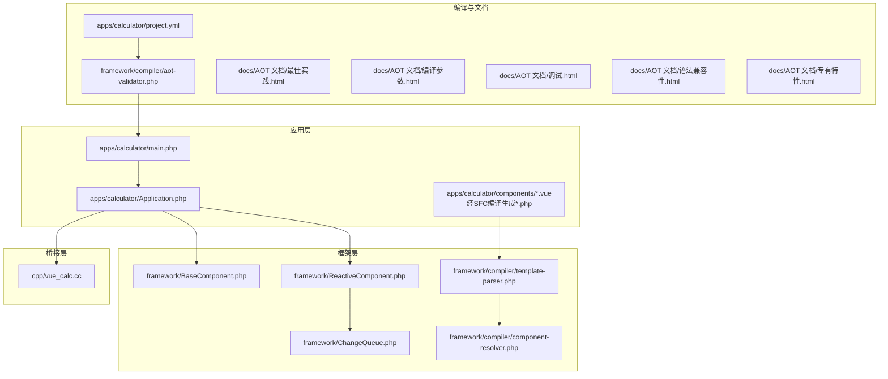
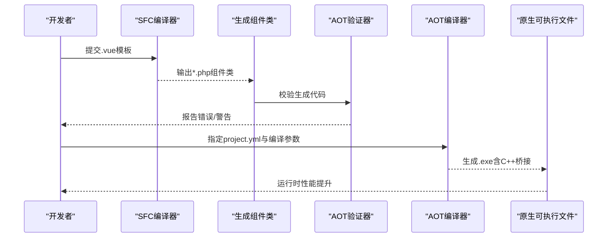
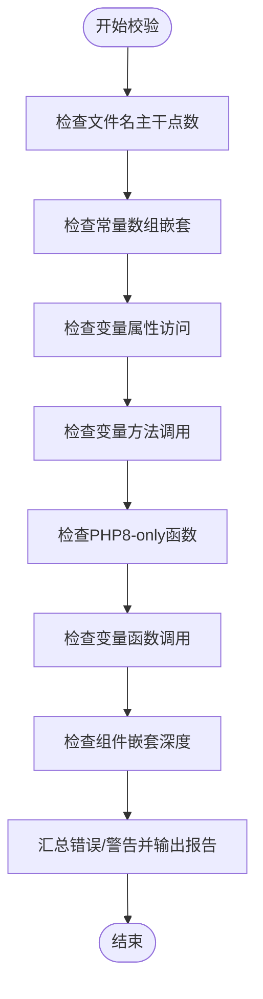
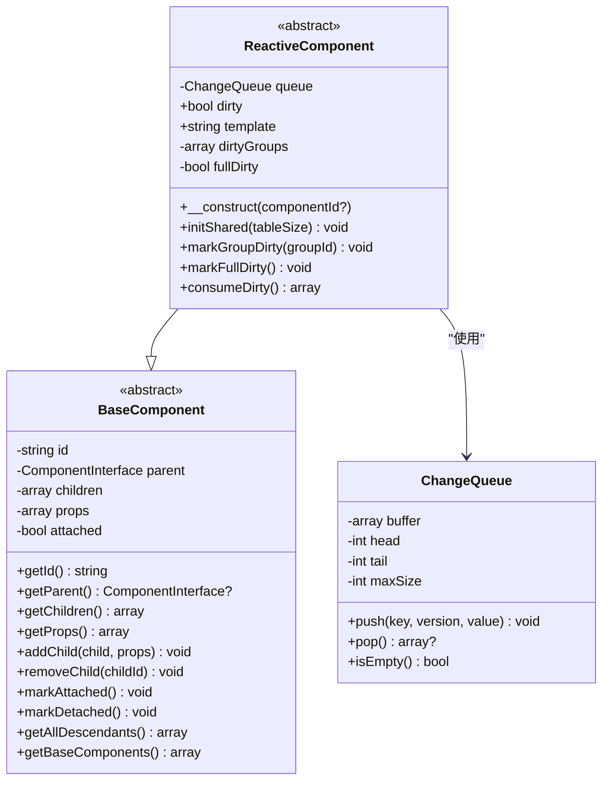
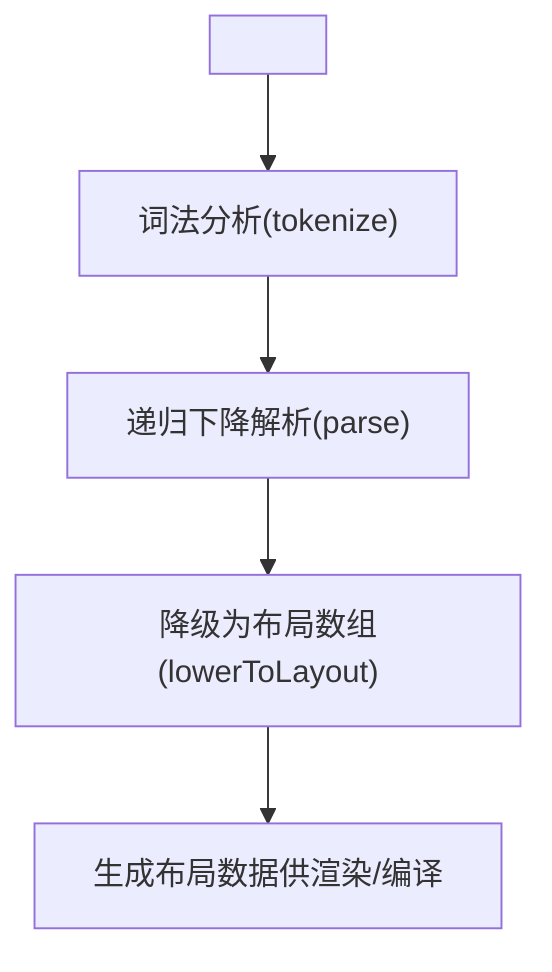
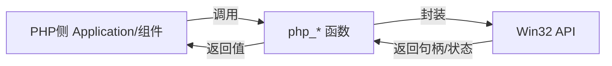
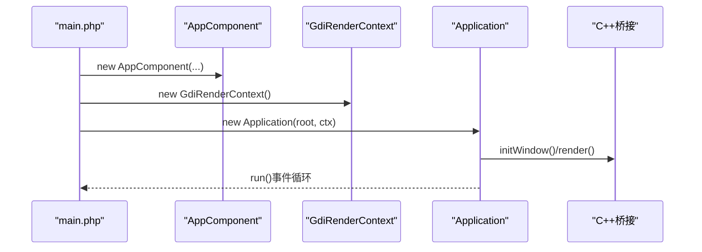
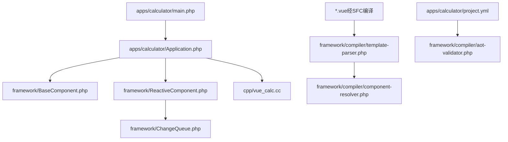

# AOT编译优化

<cite>
**本文引用的文件**
- [aot-validator.php](file://framework/compiler/aot-validator.php)
- [BaseComponent.php](file://framework/BaseComponent.php)
- [ReactiveComponent.php](file://framework/ReactiveComponent.php)
- [ChangeQueue.php](file://framework/ChangeQueue.php)
- [template-parser.php](file://framework/compiler/template-parser.php)
- [component-resolver.php](file://framework/compiler/component-resolver.php)
- [vue_calc.cc](file://cpp/vue_calc.cc)
- [Application.php](file://apps/calculator/Application.php)
- [main.php](file://apps/calculator/main.php)
- [project.yml](file://apps/calculator/project.yml)
- [最佳实践.html](file://docs/AOT 文档/最佳实践.html)
- [编译参数.html](file://docs/AOT 文档/编译参数.html)
- [调试.html](file://docs/AOT 文档/调试.html)
- [语法兼容性.html](file://docs/AOT 文档/语法兼容性.html)
- [专有特性.html](file://docs/AOT 文档/专有特性.html)
</cite>

## 目录
1. [简介](#简介)
2. [项目结构](#项目结构)
3. [核心组件](#核心组件)
4. [架构总览](#架构总览)
5. [详细组件分析](#详细组件分析)
6. [依赖关系分析](#依赖关系分析)
7. [性能考量](#性能考量)
8. [故障排除指南](#故障排除指南)
9. [结论](#结论)
10. [附录](#附录)

## 简介
本章节面向VueCalc项目的AOT（Ahead-of-Time）编译优化，系统阐述Swoole AOT编译器的工作原理、优势与限制，以及如何将PHP代码编译为原生Windows可执行文件。文档重点覆盖：
- AOT编译器如何将PHP静态编译为C++符号，进而生成原生可执行文件或扩展
- 性能提升维度：启动速度、内存占用、运行效率
- AOT限制与约束，尤其是对魔术方法（__get/__set）的支持限制
- 项目如何通过直接属性声明与手动脏标记适配AOT编译要求
- 编译配置参数详解（编译选项、优化级别、输出格式）
- 调试技巧与故障排除方法
- 最佳实践与性能调优指南

## 项目结构
VueCalc采用“模板/组件 → SFC编译器 → 生成组件类 → AOT编译 → 原生可执行”的流水线。应用入口位于apps/calculator，框架层位于framework，C++桥接层位于cpp。

**图示来源**
- [main.php:1-48](file://apps/calculator/main.php#L1-L48)
- [Application.php:1-322](file://apps/calculator/Application.php#L1-L322)
- [BaseComponent.php:1-177](file://framework/BaseComponent.php#L1-L177)
- [ReactiveComponent.php:1-90](file://framework/ReactiveComponent.php#L1-L90)
- [ChangeQueue.php:1-57](file://framework/ChangeQueue.php#L1-L57)
- [template-parser.php:1-869](file://framework/compiler/template-parser.php#L1-L869)
- [component-resolver.php:1-62](file://framework/compiler/component-resolver.php#L1-L62)
- [aot-validator.php:1-207](file://framework/compiler/aot-validator.php#L1-L207)
- [project.yml:1-34](file://apps/calculator/project.yml#L1-L34)
- [vue_calc.cc:1-157](file://cpp/vue_calc.cc#L1-L157)

**章节来源**
- [project.yml:1-34](file://apps/calculator/project.yml#L1-L34)
- [main.php:1-48](file://apps/calculator/main.php#L1-L48)
- [Application.php:1-322](file://apps/calculator/Application.php#L1-L322)

## 核心组件
- AOT验证器：在生成的PHP代码写盘前进行AOT兼容性校验，拦截不支持的语法与模式，避免编译失败。
- 基础组件与响应式组件：通过直接属性声明与脏标记替代魔术方法，满足AOT类型不可变性与静态编译约束。
- 模板解析器与组件解析器：将.vue模板解析为布局数组，为AOT生成稳定的布局数据。
- C++桥接层：封装Win32 API，提供窗口、消息与GDI绘制原语，供PHP侧调用。

**章节来源**
- [aot-validator.php:1-207](file://framework/compiler/aot-validator.php#L1-L207)
- [BaseComponent.php:1-177](file://framework/BaseComponent.php#L1-L177)
- [ReactiveComponent.php:1-90](file://framework/ReactiveComponent.php#L1-L90)
- [template-parser.php:1-869](file://framework/compiler/template-parser.php#L1-L869)
- [component-resolver.php:1-62](file://framework/compiler/component-resolver.php#L1-L62)
- [vue_calc.cc:1-157](file://cpp/vue_calc.cc#L1-L157)

## 架构总览
AOT编译链路从应用入口开始，经过SFC编译生成组件类，再由AOT验证器检查，最终生成原生可执行文件。渲染与交互通过C++桥接层与PHP侧协作完成。

**图示来源**
- [template-parser.php:1-869](file://framework/compiler/template-parser.php#L1-L869)
- [aot-validator.php:1-207](file://framework/compiler/aot-validator.php#L1-L207)
- [project.yml:1-34](file://apps/calculator/project.yml#L1-L34)
- [main.php:1-48](file://apps/calculator/main.php#L1-L48)

## 详细组件分析

### AOT验证器（AotValidator）
职责与规则要点：
- 文件名约束：文件名主干最多允许1个点，避免生成无效C++符号
- 常量数组限制：禁止嵌套数组常量，推荐使用函数返回数组
- 动态访问限制：禁止变量属性访问与变量方法调用
- 语言特性限制：禁止PHP8-only函数（如str_contains），推荐使用兼容写法
- 变量函数调用：禁止独立的$fn()形式，需改为显式分支
- 组件嵌套深度：v5仅支持1级嵌套（父→子）

**图示来源**
- [aot-validator.php:1-207](file://framework/compiler/aot-validator.php#L1-L207)

**章节来源**
- [aot-validator.php:1-207](file://framework/compiler/aot-validator.php#L1-L207)

### 基础组件与响应式组件
- 基础组件：提供组件树结构、父子引用、子组件管理与AOT兼容遍历方式（array_keys + for循环）
- 响应式组件：去除魔术方法，改用直接属性声明与脏标记（dirty、dirtyGroups、fullDirty），配合变更队列实现增量渲染

**图示来源**
- [BaseComponent.php:1-177](file://framework/BaseComponent.php#L1-L177)
- [ReactiveComponent.php:1-90](file://framework/ReactiveComponent.php#L1-L90)
- [ChangeQueue.php:1-57](file://framework/ChangeQueue.php#L1-L57)

**章节来源**
- [BaseComponent.php:1-177](file://framework/BaseComponent.php#L1-L177)
- [ReactiveComponent.php:1-90](file://framework/ReactiveComponent.php#L1-L90)
- [ChangeQueue.php:1-57](file://framework/ChangeQueue.php#L1-L57)

### 模板解析与组件解析
- 模板解析器：递归下降解析Vue模板，生成AST并降级为布局数组，支持v-if、v-model等指令
- 组件解析器：负责坐标偏移与属性绑定映射，便于AOT阶段稳定生成布局

**图示来源**
- [template-parser.php:1-869](file://framework/compiler/template-parser.php#L1-L869)
- [component-resolver.php:1-62](file://framework/compiler/component-resolver.php#L1-L62)

**章节来源**
- [template-parser.php:1-869](file://framework/compiler/template-parser.php#L1-L869)
- [component-resolver.php:1-62](file://framework/compiler/component-resolver.php#L1-L62)

### C++桥接层（Win32 API）
- 封装窗口创建、显示、消息轮询、双缓冲绘制与GDI绘制原语
- 通过phpx.h与PHP侧交互，提供高性能渲染与事件处理

**图示来源**
- [vue_calc.cc:1-157](file://cpp/vue_calc.cc#L1-L157)

**章节来源**
- [vue_calc.cc:1-157](file://cpp/vue_calc.cc#L1-L157)

### 应用入口与编译配置
- 应用入口main.php负责创建根组件、渲染上下文与Application，启动事件循环
- project.yml定义编译目标、模式（bin）、源码路径与组件映射

**图示来源**
- [main.php:1-48](file://apps/calculator/main.php#L1-L48)
- [Application.php:1-322](file://apps/calculator/Application.php#L1-L322)
- [project.yml:1-34](file://apps/calculator/project.yml#L1-L34)

**章节来源**
- [main.php:1-48](file://apps/calculator/main.php#L1-L48)
- [Application.php:1-322](file://apps/calculator/Application.php#L1-L322)
- [project.yml:1-34](file://apps/calculator/project.yml#L1-L34)

## 依赖关系分析
- 应用层依赖框架层组件与渲染上下文
- 框架层依赖AOT验证器与模板解析器
- 编译配置通过project.yml统一管理
- C++桥接层与PHP侧通过phpx.h函数接口耦合

**图示来源**
- [main.php:1-48](file://apps/calculator/main.php#L1-L48)
- [Application.php:1-322](file://apps/calculator/Application.php#L1-L322)
- [BaseComponent.php:1-177](file://framework/BaseComponent.php#L1-L177)
- [ReactiveComponent.php:1-90](file://framework/ReactiveComponent.php#L1-L90)
- [ChangeQueue.php:1-57](file://framework/ChangeQueue.php#L1-L57)
- [template-parser.php:1-869](file://framework/compiler/template-parser.php#L1-L869)
- [component-resolver.php:1-62](file://framework/compiler/component-resolver.php#L1-L62)
- [aot-validator.php:1-207](file://framework/compiler/aot-validator.php#L1-L207)
- [project.yml:1-34](file://apps/calculator/project.yml#L1-L34)
- [vue_calc.cc:1-157](file://cpp/vue_calc.cc#L1-L157)

**章节来源**
- [project.yml:1-34](file://apps/calculator/project.yml#L1-L34)
- [aot-validator.php:1-207](file://framework/compiler/aot-validator.php#L1-L207)

## 性能考量
- 启动速度：AOT将PHP静态编译为原生代码，避免解释执行与VM启动开销，显著缩短冷启动时间
- 内存占用：静态编译消除运行时类型推断与zval结构的间接成本，降低内存碎片与分配次数
- 运行效率：原生调用替代动态分发，结合native_types与脏标记驱动的增量渲染，进一步提升CPU利用率
- 适用场景：高吞吐、低延迟、UI渲染密集的应用（如桌面应用、游戏UI、实时控制面板）

[本节为通用性能讨论，无需列出具体文件来源]

## 故障排除指南
- 调试工具：AOT编译器仅支持gdb调试，需关闭优化（-O0）并启用调试信息（--debug-info）
- 符号命名：函数以php_前缀命名，类方法按php_{命名空间}__{类名}__{方法名}规则生成
- 常见问题定位：
  - 变量函数调用导致类型推断失败：改为显式分支或match
  - 嵌套数组常量：使用函数返回数组
  - 变量属性/方法访问：改为显式if/else映射
  - PHP8-only函数：替换为兼容写法（如strpos、strncmp、substr等）

**章节来源**
- [调试.html:1-38](file://docs/AOT 文档/调试.html#L1-L38)
- [编译参数.html:1-1](file://docs/AOT 文档/编译参数.html#L1-L1)
- [语法兼容性.html:1-44](file://docs/AOT 文档/语法兼容性.html#L1-L44)
- [aot-validator.php:1-207](file://framework/compiler/aot-validator.php#L1-L207)

## 结论
VueCalc通过Swoole AOT编译器实现了从PHP到原生Windows可执行文件的高效转换。项目以“直接属性声明 + 手动脏标记”规避魔术方法限制，结合native_types与增量渲染策略，显著提升了启动速度、内存占用与运行效率。配合严格的AOT验证与编译配置，开发者可在保证稳定性的同时获得接近C/C++的性能表现。

[本节为总结性内容，无需列出具体文件来源]

## 附录

### 编译参数详解
- -o：指定生成的可执行文件或扩展名称
- -O0/1/2/3：GCC优化等级
- --debug-info：编译时添加调试信息（默认关闭）
- -j {N}：并发编译任务数量
- -m bin/ext：编译目标为可执行文件或扩展
- --profile：开启性能分析选项

**章节来源**
- [编译参数.html:1-1](file://docs/AOT 文档/编译参数.html#L1-L1)

### 语法兼容性与限制
- 不支持$$、extract、yield/generator、多层break/continue、含\0字面量、参数数量不匹配、Property Hook、动态引用传递
- 不支持“游离代码”，所有代码必须在函数内；模板/配置文件需动态加载
- 类型不可变性：变量一旦声明为某类型，不得在运行时改变
- 未定义变量：AOT要求变量先定义再使用

**章节来源**
- [语法兼容性.html:1-44](file://docs/AOT 文档/语法兼容性.html#L1-L44)

### 专有特性与垫片函数
- use native_types：将int/float/bool转为原生类型，提升密集运算性能
- objvar(obj, class)：重建对象类型，便于native call
- any(value)：将变量标注为php::Var，保留溢出检测等能力
- refval(&value)：在动态调用中将值传递改为引用传递

**章节来源**
- [专有特性.html:1-49](file://docs/AOT 文档/专有特性.html#L1-L49)

### 最佳实践
- vendor目录建议使用Composer Autoload，或通过白名单/ignore配置选择性编译
- AOT编译器采用动态链接，分发时需携带libphp.so与libphpx.so，并保持系统基础库一致
- __FILE__/__DIR__在AOT中为编译时值，建议使用getcwd()或配置文件方式确定运行时目录

**章节来源**
- [最佳实践.html:1-14](file://docs/AOT 文档/最佳实践.html#L1-L14)