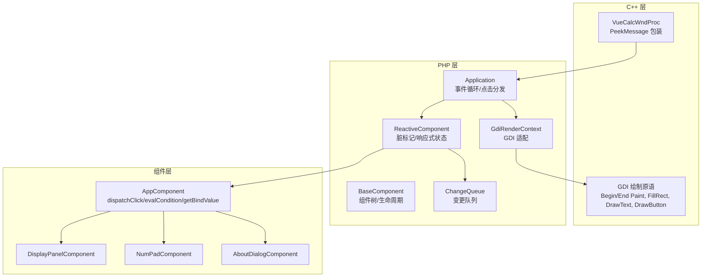
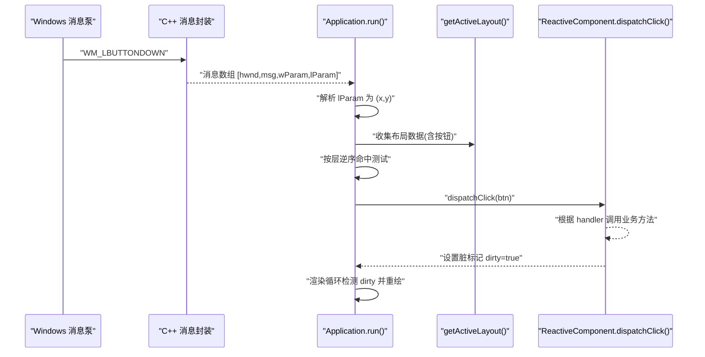
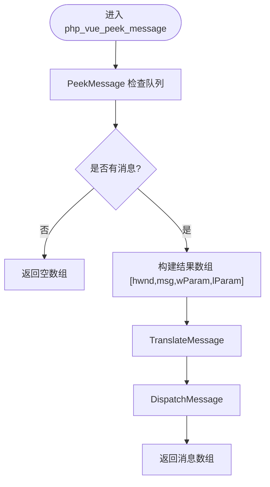
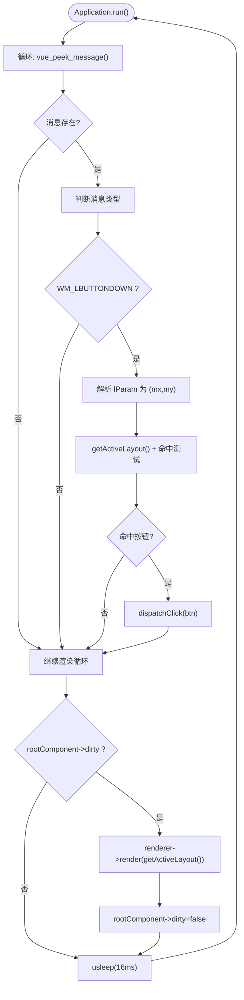
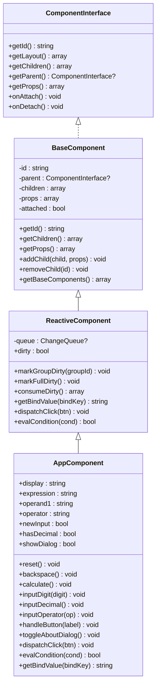
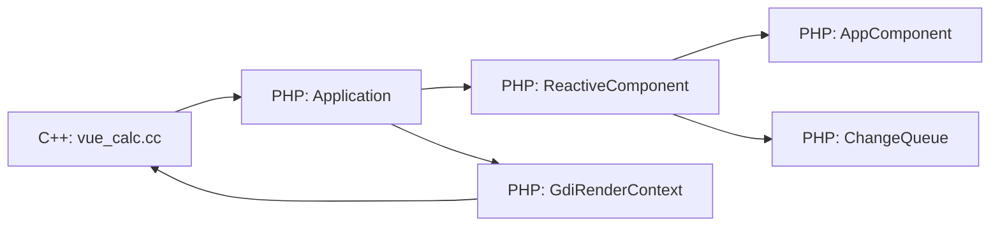

# 事件处理机制

<cite>
**本文引用的文件**
- [vue_calc.cc](file://cpp/vue_calc.cc)
- [Application.php](file://apps/calculator/Application.php)
- [main.php](file://apps/calculator/main.php)
- [BaseComponent.php](file://framework/BaseComponent.php)
- [ReactiveComponent.php](file://framework/ReactiveComponent.php)
- [ComponentInterface.php](file://framework/interfaces/ComponentInterface.php)
- [GdiRenderContext.php](file://framework/rendering/GdiRenderContext.php)
- [ChangeQueue.php](file://framework/ChangeQueue.php)
- [AppComponent.php](file://apps/calculator/gen/AppComponent.php)
- [DisplayPanel.vue](file://apps/calculator/components/DisplayPanel.vue)
- [NumPad.vue](file://apps/calculator/components/NumPad.vue)
- [AboutDialog.vue](file://apps/calculator/components/AboutDialog.vue)
- [sfc-compiler.php](file://framework/sfc-compiler.php)
- [template-parser.php](file://framework/compiler/template-parser.php)
</cite>

## 目录
1. [简介](#简介)
2. [项目结构](#项目结构)
3. [核心组件](#核心组件)
4. [架构总览](#架构总览)
5. [详细组件分析](#详细组件分析)
6. [依赖关系分析](#依赖关系分析)
7. [性能考虑](#性能考虑)
8. [故障排查指南](#故障排查指南)
9. [结论](#结论)
10. [附录](#附录)

## 简介
本文件系统性阐述 VueCalc 项目的事件处理机制，覆盖从 Windows 消息泵到组件事件响应的完整链路。重点包括：
- Windows 消息捕获与路由：WM_LBUTTONDOWN 的处理与坐标提取
- 分层事件架构：C++ 底层消息封装、PHP 应用层事件分发、组件层事件响应
- 性能优化策略：消息批处理与事件去抖动建议
- 调试技巧：事件跟踪与性能分析方法
- 扩展机制：新增事件类型与自定义处理器的接入方式
- 实现指南与最佳实践：帮助开发者快速集成与维护事件系统

## 项目结构
VueCalc 采用“模板即布局”的单文件组件（SFC）编译体系，结合 C++ phpx 扩展提供底层 Win32 API 与 GDI 绘制能力。事件处理涉及以下关键模块：
- C++ 层：封装 Win32 窗口与消息泵，提供 PeekMessage 包装与 GDI 原语
- PHP 层：应用控制器负责窗口初始化、事件循环与点击分发
- 组件层：响应式组件树承载业务状态与事件处理逻辑
- 编译器：将 .vue 模板编译为布局数组与组件类，自动生成事件处理器与条件求值

**图表来源**
- [vue_calc.cc:21-84](file://cpp/vue_calc.cc#L21-L84)
- [Application.php:205-263](file://apps/calculator/Application.php#L205-L263)
- [ReactiveComponent.php:14-90](file://framework/ReactiveComponent.php#L14-L90)
- [BaseComponent.php:16-177](file://framework/BaseComponent.php#L16-L177)
- [GdiRenderContext.php:11-37](file://framework/rendering/GdiRenderContext.php#L11-L37)
- [ChangeQueue.php:11-57](file://framework/ChangeQueue.php#L11-L57)
- [AppComponent.php:11-787](file://apps/calculator/gen/AppComponent.php#L11-L787)

**章节来源**
- [vue_calc.cc:1-157](file://cpp/vue_calc.cc#L1-L157)
- [Application.php:15-322](file://apps/calculator/Application.php#L15-L322)
- [main.php:19-48](file://apps/calculator/main.php#L19-L48)
- [ReactiveComponent.php:14-90](file://framework/ReactiveComponent.php#L14-L90)
- [BaseComponent.php:16-177](file://framework/BaseComponent.php#L16-L177)
- [GdiRenderContext.php:11-37](file://framework/rendering/GdiRenderContext.php#L11-L37)
- [ChangeQueue.php:11-57](file://framework/ChangeQueue.php#L11-L57)
- [AppComponent.php:11-787](file://apps/calculator/gen/AppComponent.php#L11-L787)

## 核心组件
- C++ 消息与绘制封装：提供窗口过程、消息轮询、双缓冲绘制与基础图形原语
- Application 事件循环：从 C++ 层批量获取消息，解析 WM_LBUTTONDOWN，执行命中测试与点击分发
- ReactiveComponent/ComponentInterface：定义组件接口、响应式状态与脏标记，以及 dispatchClick/evalCondition 抽象
- GdiRenderContext：将渲染指令委托给 C++ GDI 原语
- ChangeQueue：环形缓冲变更队列，支持渲染循环消费

**章节来源**
- [vue_calc.cc:21-157](file://cpp/vue_calc.cc#L21-L157)
- [Application.php:205-322](file://apps/calculator/Application.php#L205-L322)
- [ReactiveComponent.php:14-90](file://framework/ReactiveComponent.php#L14-L90)
- [ComponentInterface.php:13-52](file://framework/interfaces/ComponentInterface.php#L13-L52)
- [GdiRenderContext.php:11-37](file://framework/rendering/GdiRenderContext.php#L11-L37)
- [ChangeQueue.php:11-57](file://framework/ChangeQueue.php#L11-L57)

## 架构总览
事件处理从 Windows 消息泵开始，经 C++ 层封装进入 PHP 应用层，最终由组件层响应。整体流程如下：

**图表来源**
- [vue_calc.cc:69-84](file://cpp/vue_calc.cc#L69-L84)
- [Application.php:214-263](file://apps/calculator/Application.php#L214-L263)
- [Application.php:269-321](file://apps/calculator/Application.php#L269-L321)
- [ReactiveComponent.php:81-89](file://framework/ReactiveComponent.php#L81-L89)
- [AppComponent.php:731-750](file://apps/calculator/gen/AppComponent.php#L731-L750)

## 详细组件分析

### C++ 底层消息与绘制
- 窗口过程：处理 WM_CLOSE/WM_DESTROY，交由应用层控制退出
- 消息轮询：PeekMessage 包装返回数组，包含 hwnd/msg/wParam/lParam；随后 TranslateMessage/DispatchMessage
- GDI 原语：Begin/End Paint 双缓冲、FillRect、DrawText、DrawButton

**图表来源**
- [vue_calc.cc:69-84](file://cpp/vue_calc.cc#L69-L84)

**章节来源**
- [vue_calc.cc:21-84](file://cpp/vue_calc.cc#L21-L84)
- [vue_calc.cc:90-157](file://cpp/vue_calc.cc#L90-L157)

### PHP 应用层事件循环与点击分发
- 初始化窗口与渲染器，挂载根组件并生成初始组件树
- 事件循环：持续调用 C++ PeekMessage，解析 WM_LBUTTONDOWN 的 lParam 为 (x,y)
- 命中测试：先确定最高活跃层，再从最高层逆序进行命中测试，支持条件过滤
- 分发点击：命中后调用根组件的 dispatchClick，由组件层决定具体业务行为

**图表来源**
- [Application.php:205-263](file://apps/calculator/Application.php#L205-L263)
- [Application.php:269-321](file://apps/calculator/Application.php#L269-L321)

**章节来源**
- [Application.php:51-76](file://apps/calculator/Application.php#L51-L76)
- [Application.php:205-321](file://apps/calculator/Application.php#L205-L321)

### 组件层事件响应与条件求值
- ReactiveComponent 定义 dispatchClick/evalCondition 抽象，子类实现具体业务
- AppComponent 实现：
  - dispatchClick：根据按钮的 handler 分派到 reset/backspace/calculate/handleButton/toggleAboutDialog
  - evalCondition：支持 truthy/falsy/==/!= 条件，基于组件属性求值
  - getBindValue：将绑定键映射到组件字段，供渲染使用
- 组件树：根组件注册子组件（显示面板、数字键盘、关于对话框），支持叠加层与条件显隐

**图表来源**
- [ComponentInterface.php:13-52](file://framework/interfaces/ComponentInterface.php#L13-L52)
- [BaseComponent.php:16-177](file://framework/BaseComponent.php#L16-L177)
- [ReactiveComponent.php:14-90](file://framework/ReactiveComponent.php#L14-L90)
- [AppComponent.php:11-787](file://apps/calculator/gen/AppComponent.php#L11-L787)

**章节来源**
- [ReactiveComponent.php:14-90](file://framework/ReactiveComponent.php#L14-L90)
- [AppComponent.php:41-181](file://apps/calculator/gen/AppComponent.php#L41-L181)
- [AppComponent.php:731-779](file://apps/calculator/gen/AppComponent.php#L731-L779)

### 渲染与条件显示
- GdiRenderContext 将渲染指令委托给 C++ GDI 原语，实现双缓冲绘制与文本/按钮渲染
- 条件显示：按钮与元素支持 v-if 条件，编译期生成 condition 字段，运行时 evalCondition 求值

**章节来源**
- [GdiRenderContext.php:11-37](file://framework/rendering/GdiRenderContext.php#L11-L37)
- [template-parser.php:557-686](file://framework/compiler/template-parser.php#L557-L686)
- [AppComponent.php:247-283](file://apps/calculator/gen/AppComponent.php#L247-L283)

### 编译器与布局生成
- 模板解析：递归下降解析 <app>/<rect>/<text>/<grid>/<btn> 等节点
- 布局生成：编译期计算按钮坐标、收集绑定键、生成处理器映射与条件属性
- 代码生成：自动生成 getLayout()/dispatchClick()/evalCondition()/getBindValue()

**章节来源**
- [sfc-compiler.php:360-582](file://framework/sfc-compiler.php#L360-L582)
- [template-parser.php:548-686](file://framework/compiler/template-parser.php#L548-L686)

## 依赖关系分析
- C++ 与 PHP：通过 phpx 扩展导出函数（如 vue_window_create/show/peek_message/paint/text/button）连接
- 应用层与组件层：Application 依赖 ReactiveComponent 接口，通过 getActiveLayout() 收集布局并驱动命中测试
- 组件层与渲染层：ReactiveComponent 持有 ChangeQueue，配合渲染器按需重绘

**图表来源**
- [vue_calc.cc:36-84](file://cpp/vue_calc.cc#L36-L84)
- [Application.php:51-76](file://apps/calculator/Application.php#L51-L76)
- [ReactiveComponent.php:17-40](file://framework/ReactiveComponent.php#L17-L40)
- [GdiRenderContext.php:13-36](file://framework/rendering/GdiRenderContext.php#L13-L36)

**章节来源**
- [vue_calc.cc:36-84](file://cpp/vue_calc.cc#L36-L84)
- [Application.php:51-76](file://apps/calculator/Application.php#L51-L76)
- [ReactiveComponent.php:17-40](file://framework/ReactiveComponent.php#L17-L40)
- [GdiRenderContext.php:13-36](file://framework/rendering/GdiRenderContext.php#L13-L36)

## 性能考虑
- 消息批处理：应用层在每次事件循环中尽可能批量处理消息，减少跨语言调用次数
- 命中测试优化：先确定最高活跃层，再逆序命中，避免对低层无效按钮的重复检查
- 脏标记驱动渲染：仅在 dirty=true 时触发渲染，降低重绘频率
- 渲染节流：固定 usleep(16ms) 控制帧率，避免过度占用 CPU
- 建议的去抖动：对高频事件（如拖拽、连续点击）可在 dispatchClick 前增加去抖策略，避免重复处理

[本节为通用性能指导，无需特定文件引用]

## 故障排查指南
- 事件未响应
  - 检查 C++ 层是否正确返回消息数组，确认 WM_LBUTTONDOWN 被解析
  - 核对 Application 的命中测试逻辑与按钮条件
- 坐标异常
  - 确认 lParam 的低位/高位字拆分正确，且与布局偏移一致
- 渲染不更新
  - 确认组件在处理事件后设置了 dirty=true，并在渲染循环中被消费
- 条件显示不生效
  - 检查 evalCondition 的条件表达式与属性名称是否匹配

**章节来源**
- [vue_calc.cc:69-84](file://cpp/vue_calc.cc#L69-L84)
- [Application.php:269-321](file://apps/calculator/Application.php#L269-L321)
- [ReactiveComponent.php:56-64](file://framework/ReactiveComponent.php#L56-L64)
- [AppComponent.php:752-779](file://apps/calculator/gen/AppComponent.php#L752-L779)

## 结论
VueCalc 的事件处理以“模板即布局”为核心，通过编译器将 .vue 转换为布局数组与组件类，结合 C++ 消息封装与 PHP 应用层事件循环，形成清晰的三层架构。该设计既保证了开发效率，又兼顾了运行时性能与可维护性。

## 附录

### 鼠标事件捕获与坐标计算详解
- 消息来源：WM_LBUTTONDOWN 由 C++ 层封装并返回 lParam
- 坐标提取：lParam 的低 16 位为 x，高 16 位为 y
- 命中测试：先筛选满足条件的按钮，再按层逆序命中，确保最上层按钮优先响应

**章节来源**
- [Application.php:223-233](file://apps/calculator/Application.php#L223-L233)
- [Application.php:269-311](file://apps/calculator/Application.php#L269-L311)

### 新增事件类型的扩展步骤
- 模板侧：在 .vue 中新增支持的元素或指令（当前解析器支持 app/rect/text/grid/btn 与 v-if）
- 编译器侧：在模板解析器中扩展节点类型与布局生成逻辑
- 组件侧：在组件类中实现对应的事件处理方法，并在 dispatchClick 中添加分支
- 渲染侧：如需新增绘制原语，可在 GdiRenderContext 中扩展对应方法

**章节来源**
- [template-parser.php:293-488](file://framework/compiler/template-parser.php#L293-L488)
- [template-parser.php:557-686](file://framework/compiler/template-parser.php#L557-L686)
- [sfc-compiler.php:360-582](file://framework/sfc-compiler.php#L360-L582)
- [GdiRenderContext.php:11-37](file://framework/rendering/GdiRenderContext.php#L11-L37)

### 自定义事件处理器的最佳实践
- 保持处理器幂等：多次触发不应产生副作用累积
- 使用脏标记：在修改状态后设置 dirty=true，确保渲染循环及时更新
- 条件化渲染：通过 v-if 与 evalCondition 控制可见性，避免无效交互
- 错误隔离：在 Application 的事件处理中捕获异常，避免中断事件循环

**章节来源**
- [ReactiveComponent.php:19-64](file://framework/ReactiveComponent.php#L19-L64)
- [Application.php:227-232](file://apps/calculator/Application.php#L227-L232)