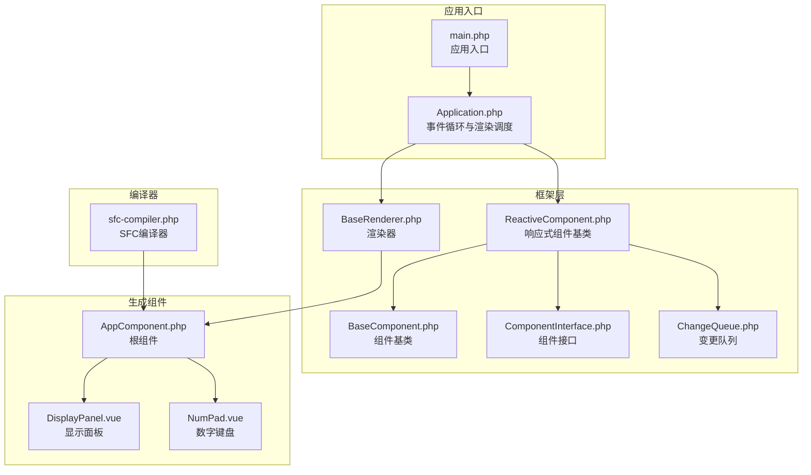
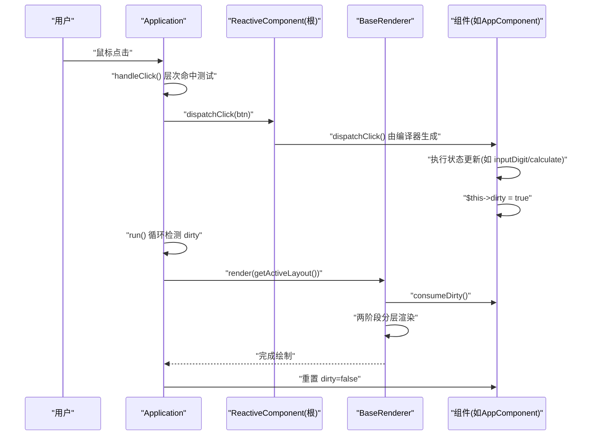
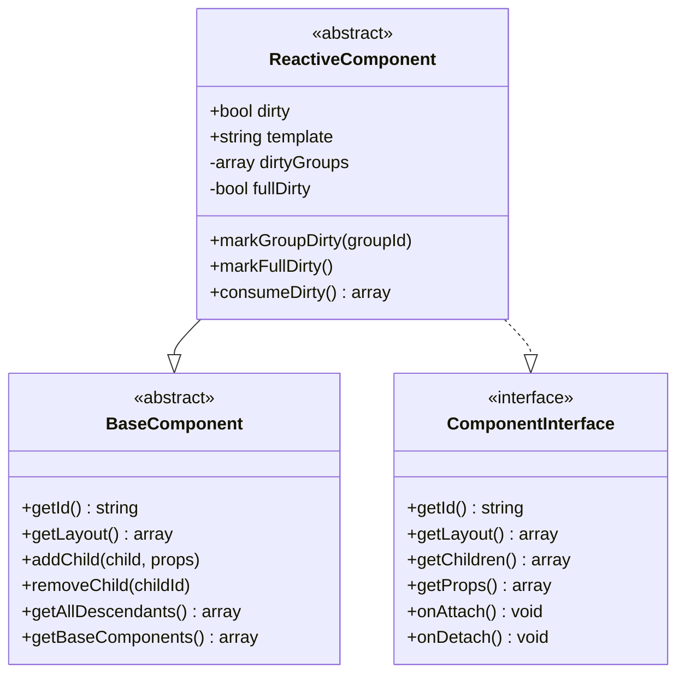
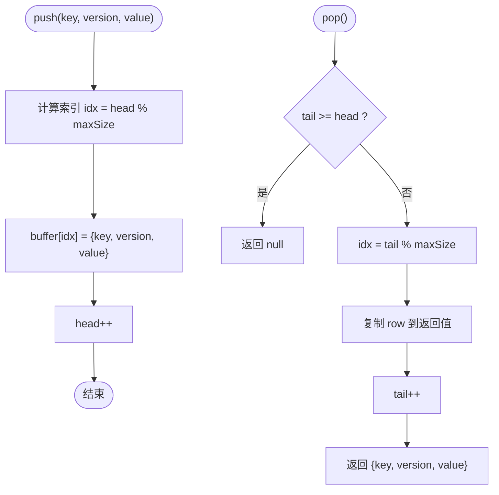
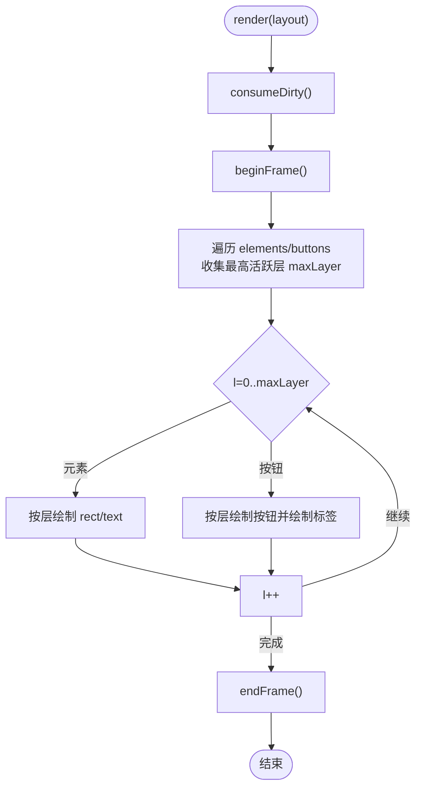
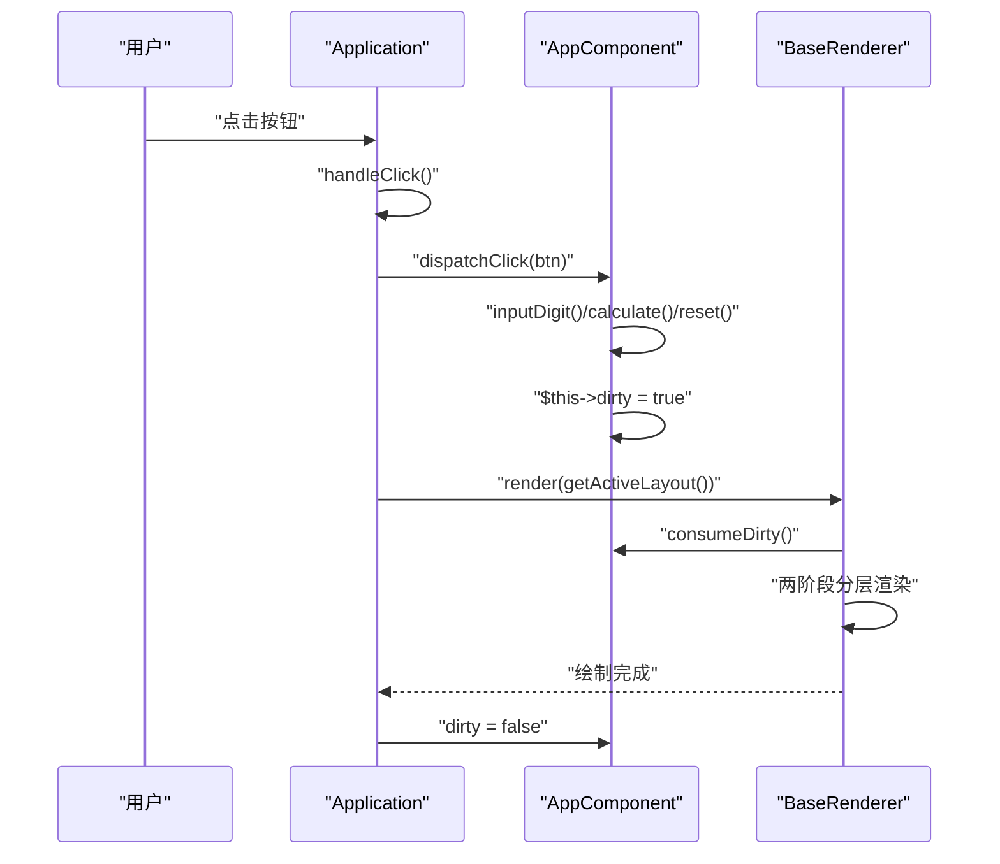
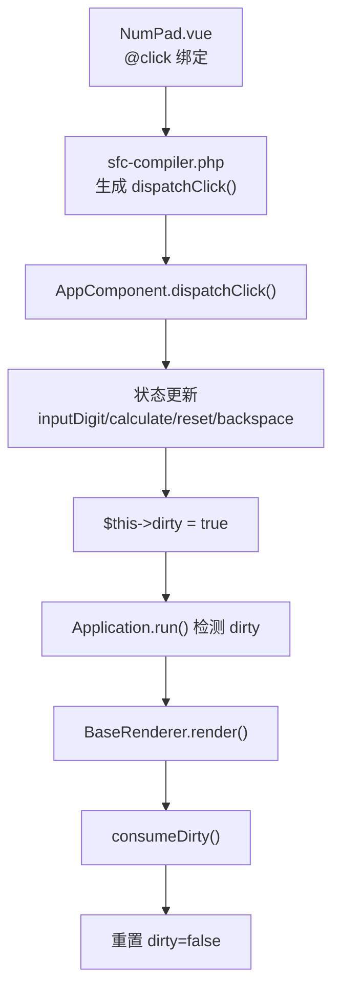
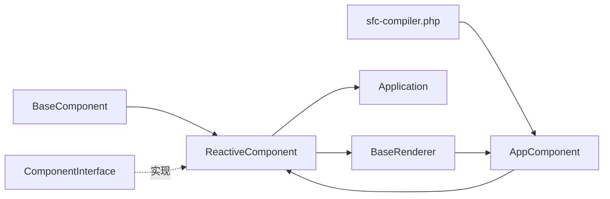

# 响应式数据驱动渲染

<cite>
**本文引用的文件**
- [ReactiveComponent.php](file://framework/ReactiveComponent.php)
- [ChangeQueue.php](file://framework/ChangeQueue.php)
- [BaseComponent.php](file://framework/BaseComponent.php)
- [ComponentInterface.php](file://framework/interfaces/ComponentInterface.php)
- [BaseRenderer.php](file://framework/BaseRenderer.php)
- [Application.php](file://apps/calculator/Application.php)
- [main.php](file://apps/calculator/main.php)
- [App.vue](file://apps/calculator/App.vue)
- [AppComponent.php](file://apps/calculator/gen/AppComponent.php)
- [DisplayPanel.vue](file://apps/calculator/components/DisplayPanel.vue)
- [NumPad.vue](file://apps/calculator/components/NumPad.vue)
- [sfc-compiler.php](file://framework/sfc-compiler.php)
- [开发经验与教训_v2.md](file://docs/开发经验与教训_v2.md)
- [VueCalc迭代v4归档_M2响应系统完善.html](file://docs/VueCalc迭代v4归档_M2响应系统完善.html)
</cite>

## 目录
1. [简介](#简介)
2. [项目结构](#项目结构)
3. [核心组件](#核心组件)
4. [架构总览](#架构总览)
5. [详细组件分析](#详细组件分析)
6. [依赖关系分析](#依赖关系分析)
7. [性能考量](#性能考量)
8. [故障排查指南](#故障排查指南)
9. [结论](#结论)
10. [附录](#附录)

## 简介
本篇文档围绕VueCalc项目的“响应式数据驱动渲染”特性进行系统化阐述，重点解释以下主题：
- UI = f(state)的设计理念与实现机制
- 脏标记（dirty flag）机制的工作原理与使用方式
- 响应式组件基类ReactiveComponent的设计思路与职责边界
- 变更队列ChangeQueue的定位与扩展价值
- 事件处理到数据更新再到渲染的完整端到端数据流
- 在Calculator组件中的状态管理与渲染优化实践
- 响应式编程最佳实践与性能优化建议

## 项目结构
VueCalc采用“单文件组件（SFC）+ 编译器预处理 + AOT编译”的架构。应用入口通过main.php启动，Application负责事件循环与渲染调度；ReactiveComponent作为响应式组件基类，承载脏标记与布局数据；BaseRenderer执行两阶段分层渲染；编译器sfc-compiler.php将.vue模板编译为具体组件类（如AppComponent.php），自动生成dispatchClick等方法体，确保事件到状态的映射清晰且可维护。



图表来源
- [main.php:19-48](file://apps/calculator/main.php#L19-L48)
- [Application.php:15-322](file://apps/calculator/Application.php#L15-L322)
- [ReactiveComponent.php:14-90](file://framework/ReactiveComponent.php#L14-L90)
- [BaseComponent.php:16-177](file://framework/BaseComponent.php#L16-L177)
- [ComponentInterface.php:13-52](file://framework/interfaces/ComponentInterface.php#L13-L52)
- [BaseRenderer.php:15-197](file://framework/BaseRenderer.php#L15-L197)
- [ChangeQueue.php:11-57](file://framework/ChangeQueue.php#L11-L57)
- [sfc-compiler.php:371-698](file://framework/sfc-compiler.php#L371-L698)
- [AppComponent.php:11-200](file://apps/calculator/gen/AppComponent.php#L11-L200)
- [DisplayPanel.vue:1-12](file://apps/calculator/components/DisplayPanel.vue#L1-L12)
- [NumPad.vue:1-37](file://apps/calculator/components/NumPad.vue#L1-L37)

章节来源
- [main.php:19-48](file://apps/calculator/main.php#L19-L48)
- [Application.php:15-322](file://apps/calculator/Application.php#L15-L322)
- [ReactiveComponent.php:14-90](file://framework/ReactiveComponent.php#L14-L90)
- [BaseComponent.php:16-177](file://framework/BaseComponent.php#L16-L177)
- [ComponentInterface.php:13-52](file://framework/interfaces/ComponentInterface.php#L13-L52)
- [BaseRenderer.php:15-197](file://framework/BaseRenderer.php#L15-L197)
- [ChangeQueue.php:11-57](file://framework/ChangeQueue.php#L11-L57)
- [sfc-compiler.php:371-698](file://framework/sfc-compiler.php#L371-L698)
- [AppComponent.php:11-200](file://apps/calculator/gen/AppComponent.php#L11-L200)
- [DisplayPanel.vue:1-12](file://apps/calculator/components/DisplayPanel.vue#L1-L12)
- [NumPad.vue:1-37](file://apps/calculator/components/NumPad.vue#L1-L37)

## 核心组件
- ReactiveComponent：响应式组件基类，提供脏标记、模板路径、分组级脏标记与全量脏标记、消费脏状态等能力，并定义三个抽象方法：getBindValue、dispatchClick、evalCondition。
- BaseComponent：组件基类，提供组件树结构、父子关系、子组件管理、生命周期钩子等通用能力。
- ComponentInterface：组件接口，统一组件的标识、布局、子组件、属性、生命周期等契约。
- BaseRenderer：渲染器，负责两阶段分层渲染（确定最高活跃层、按层绘制），并消费组件的脏状态信息。
- ChangeQueue：变更通知队列，环形缓冲实现，为未来增量渲染提供扩展点（当前未在主流程使用）。
- Application：应用控制器，负责窗口初始化、事件循环、点击分发、布局收集与渲染调度。
- 生成组件（如AppComponent.php）：由SFC编译器生成，继承ReactiveComponent，包含业务状态与方法，末尾显式设置$dirty以触发渲染。

章节来源
- [ReactiveComponent.php:14-90](file://framework/ReactiveComponent.php#L14-L90)
- [BaseComponent.php:16-177](file://framework/BaseComponent.php#L16-L177)
- [ComponentInterface.php:13-52](file://framework/interfaces/ComponentInterface.php#L13-L52)
- [BaseRenderer.php:15-197](file://framework/BaseRenderer.php#L15-L197)
- [ChangeQueue.php:11-57](file://framework/ChangeQueue.php#L11-L57)
- [Application.php:15-322](file://apps/calculator/Application.php#L15-L322)
- [AppComponent.php:11-200](file://apps/calculator/gen/AppComponent.php#L11-L200)

## 架构总览
VueCalc遵循“UI = f(state)”的数据驱动渲染范式：状态变更通过事件触发，状态更新后设置脏标记，事件循环检测到脏标记后触发渲染器，渲染器根据布局数据与脏状态信息进行两阶段分层渲染。



图表来源
- [Application.php:205-263](file://apps/calculator/Application.php#L205-L263)
- [BaseRenderer.php:98-197](file://framework/BaseRenderer.php#L98-L197)
- [AppComponent.php:162-181](file://apps/calculator/gen/AppComponent.php#L162-L181)
- [sfc-compiler.php:383-403](file://framework/sfc-compiler.php#L383-L403)

## 详细组件分析

### ReactiveComponent：响应式组件基类
- 设计要点
  - 脏标记：$dirty布尔值，表示是否需要重绘
  - 分组级脏标记：$dirtyGroups数组，支持按组粒度的脏标记追踪
  - 全量脏标记：$fullDirty布尔值，指示是否需要全量重绘
  - 脏状态消费：consumeDirty()返回脏信息并重置内部状态
  - 抽象方法：getBindValue、dispatchClick、evalCondition，由编译器生成具体实现
- AOT兼容策略
  - 放弃__get/__set魔术方法，改为直接属性声明 + 手动脏标记
  - 保留ChangeQueue与ReactiveValue作为扩展接口，供未来增量渲染使用



图表来源
- [ReactiveComponent.php:14-90](file://framework/ReactiveComponent.php#L14-L90)
- [BaseComponent.php:16-177](file://framework/BaseComponent.php#L16-L177)
- [ComponentInterface.php:13-52](file://framework/interfaces/ComponentInterface.php#L13-L52)

章节来源
- [ReactiveComponent.php:14-90](file://framework/ReactiveComponent.php#L14-L90)
- [BaseComponent.php:16-177](file://framework/BaseComponent.php#L16-L177)
- [ComponentInterface.php:13-52](file://framework/interfaces/ComponentInterface.php#L13-L52)
- [开发经验与教训_v2.md:89-91](file://docs/开发经验与教训_v2.md#L89-L91)

### ChangeQueue：变更通知队列
- 设计要点
  - 环形缓冲实现，固定最大容量，push/pop支持O(1)时间复杂度
  - 存储键名、版本号与字符串化值，便于后续增量渲染
- 当前用途
  - 未在主渲染流程中使用，作为未来增量渲染的扩展接口保留



图表来源
- [ChangeQueue.php:23-55](file://framework/ChangeQueue.php#L23-L55)

章节来源
- [ChangeQueue.php:11-57](file://framework/ChangeQueue.php#L11-L57)

### BaseRenderer：两阶段分层渲染
- 设计要点
  - 消费脏状态：调用组件的consumeDirty()获取全量/分组脏信息
  - 两阶段渲染：先确定最高活跃层，再按层绘制元素与按钮
  - 条件渲染：evalCondition(cond)支持按条件显示/隐藏元素
  - 文本渲染：支持对齐、容器宽度、动态字号等布局细节
- AOT兼容性
  - 使用array_keys()+for循环避免foreach遍历关联数组的类型推断问题
  - 使用(array)类型转换保持数组引用



图表来源
- [BaseRenderer.php:98-197](file://framework/BaseRenderer.php#L98-L197)

章节来源
- [BaseRenderer.php:15-197](file://framework/BaseRenderer.php#L15-L197)

### Application：事件循环与渲染调度
- 设计要点
  - 初始化窗口、挂载组件树、创建渲染器
  - 事件循环：消息轮询 -> 点击处理 -> 脏标记检测 -> 渲染 -> 重置脏标记
  - 布局收集：递归遍历组件树，动态应用偏移与容器坐标
  - 点击分发：层次命中测试，从最高层向下逆序查找
- 性能与稳定性
  - 每帧usleep(16000)控制约60FPS
  - try/catch包裹渲染与点击处理，避免崩溃中断

```mermaid
sequenceDiagram
participant Loop as "Application.run()"
participant Msg as "消息队列"
participant Click as "handleClick()"
participant Root as "ReactiveComponent"
participant Render as "BaseRenderer"
Loop->>Msg : "vue_peek_message()"
alt 有消息
Msg-->>Loop : "消息"
Loop->>Click : "处理点击"
Click->>Root : "dispatchClick(btn)"
end
Loop->>Loop : "检测 Root.dirty"
alt 脏标记为真
Loop->>Render : "render(getActiveLayout())"
Render-->>Loop : "完成绘制"
Loop->>Root : "dirty = false"
end
Loop->>Loop : "usleep(16000)"
```

图表来源
- [Application.php:205-263](file://apps/calculator/Application.php#L205-L263)

章节来源
- [Application.php:15-322](file://apps/calculator/Application.php#L15-L322)

### 生成组件（AppComponent）：状态管理与渲染优化
- 设计要点
  - 直接声明业务状态属性（display、expression、operand1、operator、newInput、hasDecimal、showDialog等）
  - 每个修改状态的方法末尾显式设置$dirty=true，确保AOT环境下行为确定
  - 编译器自动生成dispatchClick()，根据@click绑定映射到对应方法
- 事件到渲染的端到端流程
  - 用户点击按钮 -> Application.handleClick()命中测试 -> dispatchClick() -> 生成方法（如inputDigit/calculate/reset） -> 更新状态 -> $dirty=true -> Application.run()检测 -> BaseRenderer.render() -> 两阶段分层渲染 -> 重置dirty=false



图表来源
- [Application.php:269-321](file://apps/calculator/Application.php#L269-L321)
- [AppComponent.php:162-181](file://apps/calculator/gen/AppComponent.php#L162-L181)
- [BaseRenderer.php:98-197](file://framework/BaseRenderer.php#L98-L197)

章节来源
- [AppComponent.php:11-200](file://apps/calculator/gen/AppComponent.php#L11-L200)
- [App.vue:25-194](file://apps/calculator/App.vue#L25-L194)
- [sfc-compiler.php:383-403](file://framework/sfc-compiler.php#L383-L403)

### 事件处理到数据更新再到渲染的完整流程
- 模板绑定与事件映射
  - NumPad.vue中通过@click绑定到组件方法（如handleButton、reset、backspace、calculate）
  - 编译器收集@click并生成dispatchClick()的分支逻辑
- 点击分发与状态更新
  - Application.handleClick()收集布局，确定最高活跃层后逆序命中测试
  - 命中按钮后调用dispatchClick()，进入生成组件的具体方法
  - 方法内执行状态更新（如inputDigit/inputOperator/calculate/reset/backspace）
  - 每个方法末尾设置$dirty=true
- 渲染与脏状态消费
  - Application.run()检测$dirty，若为真则调用BaseRenderer.render()
  - BaseRenderer.consumeDirty()消费脏状态，两阶段分层渲染
  - 渲染完成后重置$dirty=false



图表来源
- [NumPad.vue:4-27](file://apps/calculator/components/NumPad.vue#L4-L27)
- [sfc-compiler.php:383-403](file://framework/sfc-compiler.php#L383-L403)
- [AppComponent.php:162-181](file://apps/calculator/gen/AppComponent.php#L162-L181)
- [Application.php:248-257](file://apps/calculator/Application.php#L248-L257)
- [BaseRenderer.php:100-101](file://framework/BaseRenderer.php#L100-L101)

章节来源
- [NumPad.vue:1-37](file://apps/calculator/components/NumPad.vue#L1-L37)
- [sfc-compiler.php:383-403](file://framework/sfc-compiler.php#L383-L403)
- [AppComponent.php:162-181](file://apps/calculator/gen/AppComponent.php#L162-L181)
- [Application.php:248-257](file://apps/calculator/Application.php#L248-L257)
- [BaseRenderer.php:100-101](file://framework/BaseRenderer.php#L100-L101)

## 依赖关系分析
- ReactiveComponent依赖BaseComponent与ComponentInterface，提供响应式能力
- BaseRenderer依赖ReactiveComponent以获取绑定值、脏状态与条件评估
- Application依赖ReactiveComponent进行事件分发与渲染调度
- 生成组件（如AppComponent）继承ReactiveComponent，实现业务状态与方法
- sfc-compiler.php生成组件类与dispatchClick()方法体，建立模板与组件的映射



图表来源
- [BaseComponent.php:16-177](file://framework/BaseComponent.php#L16-L177)
- [ReactiveComponent.php:14-90](file://framework/ReactiveComponent.php#L14-L90)
- [ComponentInterface.php:13-52](file://framework/interfaces/ComponentInterface.php#L13-L52)
- [BaseRenderer.php:15-197](file://framework/BaseRenderer.php#L15-L197)
- [Application.php:15-322](file://apps/calculator/Application.php#L15-L322)
- [sfc-compiler.php:371-698](file://framework/sfc-compiler.php#L371-L698)
- [AppComponent.php:11-200](file://apps/calculator/gen/AppComponent.php#L11-L200)

章节来源
- [BaseComponent.php:16-177](file://framework/BaseComponent.php#L16-L177)
- [ReactiveComponent.php:14-90](file://framework/ReactiveComponent.php#L14-L90)
- [ComponentInterface.php:13-52](file://framework/interfaces/ComponentInterface.php#L13-L52)
- [BaseRenderer.php:15-197](file://framework/BaseRenderer.php#L15-L197)
- [Application.php:15-322](file://apps/calculator/Application.php#L15-L322)
- [sfc-compiler.php:371-698](file://framework/sfc-compiler.php#L371-L698)
- [AppComponent.php:11-200](file://apps/calculator/gen/AppComponent.php#L11-L200)

## 性能考量
- 脏标记驱动的渲染
  - 仅在状态变更后触发渲染，避免不必要的重绘
  - 分组级脏标记与全量脏标记结合，支持局部/全局重绘策略
- 事件循环节拍
  - 每帧usleep(16000)控制约60FPS，平衡流畅度与CPU占用
- 渲染优化
  - 两阶段分层渲染减少绘制开销，先确定最高活跃层再按层绘制
  - 文本渲染支持动态字号与对齐，避免超长文本导致的布局抖动
- AOT兼容性
  - 避免__get/__set等在AOT中不可靠的特性，采用直接属性与手动脏标记
  - 使用array_keys()+for循环与(array)类型转换规避类型推断问题

章节来源
- [Application.php:248-257](file://apps/calculator/Application.php#L248-L257)
- [BaseRenderer.php:98-197](file://framework/BaseRenderer.php#L98-L197)
- [开发经验与教训_v2.md:89-91](file://docs/开发经验与教训_v2.md#L89-L91)

## 故障排查指南
- __get/__set在AOT中不被调用
  - 症状：直接访问属性时TypeError或返回null
  - 解决：放弃魔术方法，改为直接属性声明 + 手动$dirty=true
- 静态属性类型化问题
  - 症状：PHP 8.x类型化静态属性的“未初始化”语义在AOT中引发问题
  - 解决：为静态属性提供默认值（如?ChangeQueue $queue=null）
- any()函数不存在
  - 症状：编译器报错“函数不存在”
  - 解决：移除any()，直接存储值
- json_encode不可用
  - 症状：编译器报错或运行时异常
  - 解决：避免依赖json_encode，使用字符串化或自定义序列化
- AOT环境下的数组遍历
  - 症状：foreach遍历关联数组时类型推断错误
  - 解决：使用array_keys()+for循环，配合(array)类型转换

章节来源
- [开发经验与教训_v2.md:89-91](file://docs/开发经验与教训_v2.md#L89-L91)
- [开发经验与教训_v2.md:163-169](file://docs/开发经验与教训_v2.md#L163-L169)
- [开发经验与教训_v2.md:75-79](file://docs/开发经验与教训_v2.md#L75-L79)
- [开发经验与教训_v2.md:83-87](file://docs/开发经验与教训_v2.md#L83-L87)

## 结论
VueCalc通过“UI = f(state)”的数据驱动渲染范式，结合ReactiveComponent的脏标记机制与Application的事件循环，实现了高效稳定的GUI应用。AOT约束下，采用直接属性声明与手动脏标记替代魔术方法，确保行为确定性；BaseRenderer的两阶段分层渲染与Application的事件循环共同保障了渲染性能与用户体验。编译器sfc-compiler.php将模板与组件紧密绑定，自动生成dispatchClick等方法体，简化了事件到状态的映射。未来可在保留现有稳定架构的基础上，利用ChangeQueue与ReactiveValue扩展增量渲染能力。

## 附录
- 最佳实践清单
  - 业务状态使用public属性声明，避免动态属性
  - 每个修改状态的方法末尾显式设置$dirty=true
  - 使用分组级脏标记与全量脏标记区分局部/全局重绘
  - 避免在AOT环境中使用__get/__set、any()、json_encode等不可用特性
  - 使用array_keys()+for循环与(array)类型转换提升AOT兼容性
- 性能优化建议
  - 控制脏标记粒度，尽量局部化状态更新
  - 合理使用分层渲染，减少不必要的元素绘制
  - 避免频繁创建临时对象，复用渲染上下文
  - 在事件循环中保持稳定的帧率，避免阻塞