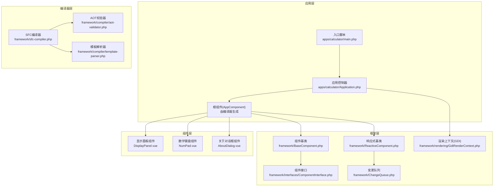
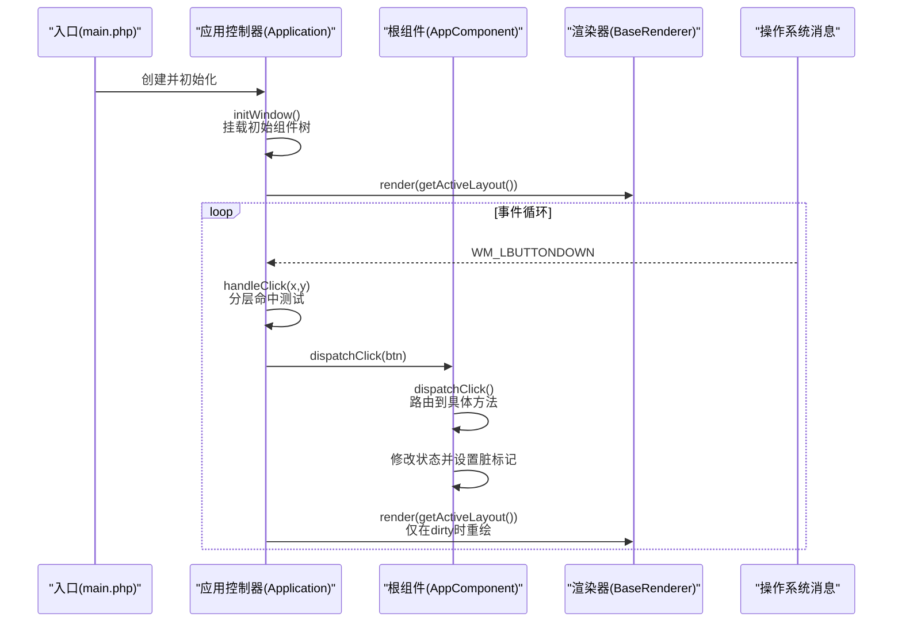
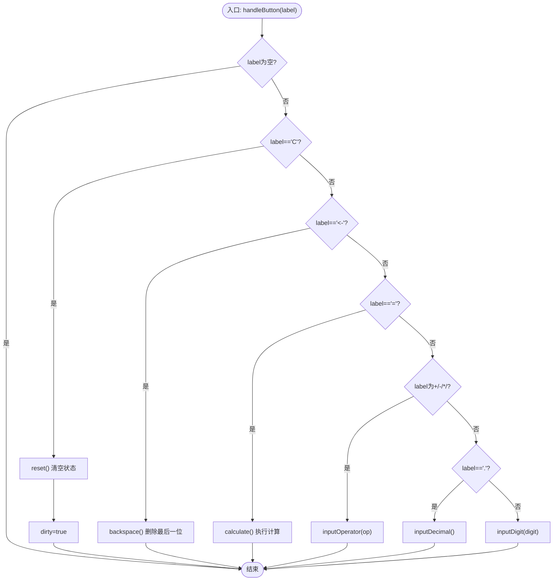
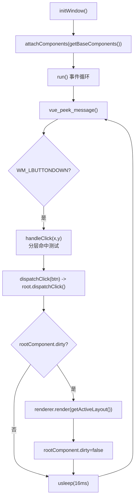
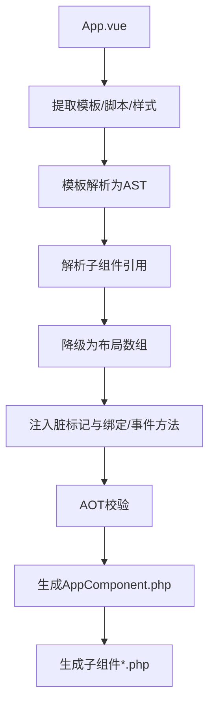
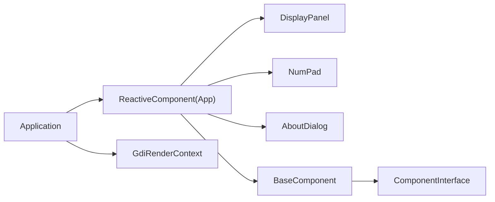

# 核心特性说明

<cite>
**本文引用的文件**
- [apps/calculator/App.vue](file://apps/calculator/App.vue)
- [apps/calculator/components/DisplayPanel.vue](file://apps/calculator/components/DisplayPanel.vue)
- [apps/calculator/components/NumPad.vue](file://apps/calculator/components/NumPad.vue)
- [apps/calculator/components/AboutDialog.vue](file://apps/calculator/components/AboutDialog.vue)
- [apps/calculator/Application.php](file://apps/calculator/Application.php)
- [apps/calculator/main.php](file://apps/calculator/main.php)
- [framework/BaseComponent.php](file://framework/BaseComponent.php)
- [framework/ReactiveComponent.php](file://framework/ReactiveComponent.php)
- [framework/interfaces/ComponentInterface.php](file://framework/interfaces/ComponentInterface.php)
- [framework/sfc-compiler.php](file://framework/sfc-compiler.php)
- [framework/compiler/aot-validator.php](file://framework/compiler/aot-validator.php)
- [framework/compiler/template-parser.php](file://framework/compiler/template-parser.php)
- [framework/ChangeQueue.php](file://framework/ChangeQueue.php)
- [framework/rendering/GdiRenderContext.php](file://framework/rendering/GdiRenderContext.php)
</cite>

## 目录
1. [简介](#简介)
2. [项目结构](#项目结构)
3. [核心组件](#核心组件)
4. [架构总览](#架构总览)
5. [详细组件分析](#详细组件分析)
6. [依赖关系分析](#依赖关系分析)
7. [性能考量](#性能考量)
8. [故障排查指南](#故障排查指南)
9. [结论](#结论)
10. [附录](#附录)

## 简介
本文件面向VueCalc项目的使用者与开发者，系统阐述项目的核心特性与实现要点，包括响应式数据驱动渲染、AOT编译优化、组件化架构、事件处理机制等。文档聚焦计算器应用的完整实现：数字输入、运算符处理、计算结果展示、错误处理；同时解析组件系统设计：主组件、显示面板、数字键盘、关于对话框的职责与交互；并结合AOT编译的约束与优势，帮助用户在保证性能的同时获得良好的开发体验。

## 项目结构
VueCalc采用“单页组件（SFC）+ 编译器 + AOT”的整体架构。应用入口负责创建根组件与应用控制器，编译器将.vue文件转换为可被AOT编译的PHP类，AOT运行时驱动渲染与事件循环。

**图表来源**
- [apps/calculator/main.php:19-48](file://apps/calculator/main.php#L19-L48)
- [apps/calculator/Application.php:15-322](file://apps/calculator/Application.php#L15-L322)
- [framework/BaseComponent.php:16-177](file://framework/BaseComponent.php#L16-L177)
- [framework/ReactiveComponent.php:14-90](file://framework/ReactiveComponent.php#L14-L90)
- [framework/interfaces/ComponentInterface.php:13-52](file://framework/interfaces/ComponentInterface.php#L13-L52)
- [framework/rendering/GdiRenderContext.php:11-38](file://framework/rendering/GdiRenderContext.php#L11-L38)
- [framework/ChangeQueue.php:11-57](file://framework/ChangeQueue.php#L11-L57)
- [framework/sfc-compiler.php:1-819](file://framework/sfc-compiler.php#L1-L819)
- [framework/compiler/aot-validator.php:18-207](file://framework/compiler/aot-validator.php#L18-L207)
- [framework/compiler/template-parser.php:61-200](file://framework/compiler/template-parser.php#L61-L200)

**章节来源**
- [apps/calculator/main.php:19-48](file://apps/calculator/main.php#L19-L48)
- [apps/calculator/Application.php:51-76](file://apps/calculator/Application.php#L51-L76)
- [framework/sfc-compiler.php:27-36](file://framework/sfc-compiler.php#L27-L36)

## 核心组件
- 响应式数据驱动渲染：通过响应式基类维护脏标记，仅在状态变更时触发渲染，降低无效重绘开销。
- 组件化架构：主组件负责布局与业务逻辑，子组件负责局部UI与交互，组件树由编译器生成的注册方法构建。
- 事件处理机制：应用控制器统一接收消息，按层进行命中测试，将点击事件分发到根组件，再由根组件路由到具体处理方法。
- AOT编译优化：编译器将模板与脚本转换为静态布局数组与方法，AOT运行时直接执行，提升启动与运行性能。

**章节来源**
- [framework/ReactiveComponent.php:14-90](file://framework/ReactiveComponent.php#L14-L90)
- [framework/BaseComponent.php:16-177](file://framework/BaseComponent.php#L16-L177)
- [apps/calculator/Application.php:205-322](file://apps/calculator/Application.php#L205-L322)
- [framework/sfc-compiler.php:360-582](file://framework/sfc-compiler.php#L360-L582)

## 架构总览
下图展示了从入口到渲染的关键流程：入口创建根组件与应用控制器，应用控制器初始化窗口并进入事件循环；事件循环根据脏标记触发渲染，渲染器基于组件树布局数据绘制；用户点击通过命中测试定位按钮，分发到根组件处理逻辑。

**图表来源**
- [apps/calculator/main.php:28-44](file://apps/calculator/main.php#L28-L44)
- [apps/calculator/Application.php:51-76](file://apps/calculator/Application.php#L51-L76)
- [apps/calculator/Application.php:205-322](file://apps/calculator/Application.php#L205-L322)

**章节来源**
- [apps/calculator/main.php:19-48](file://apps/calculator/main.php#L19-L48)
- [apps/calculator/Application.php:205-322](file://apps/calculator/Application.php#L205-L322)

## 详细组件分析

### 计算器主组件（App.vue）
- 数据模型：维护显示值、表达式、第一个操作数、当前运算符、输入状态、小数点状态、对话框状态等。
- 功能方法：
  - 重置：清空状态，回到初始态。
  - 输入数字/小数点：控制新输入与小数点重复输入。
  - 输入运算符：处理连续运算与表达式展示。
  - 计算：四则运算，含除零保护与结果格式化。
  - 退格：逐字符删除，维护小数点状态。
  - 按钮处理：统一入口，分发到对应方法。
  - 切换关于弹窗：切换对话框显隐并标记脏。
- 样式与布局：定义应用背景、显示区域、表达式文本、按钮样式，并通过子组件组合界面。

**图表来源**
- [apps/calculator/App.vue:167-186](file://apps/calculator/App.vue#L167-L186)
- [apps/calculator/App.vue:54-63](file://apps/calculator/App.vue#L54-L63)
- [apps/calculator/App.vue:65-79](file://apps/calculator/App.vue#L65-L79)
- [apps/calculator/App.vue:81-92](file://apps/calculator/App.vue#L81-L92)
- [apps/calculator/App.vue:94-104](file://apps/calculator/App.vue#L94-L104)
- [apps/calculator/App.vue:106-147](file://apps/calculator/App.vue#L106-L147)
- [apps/calculator/App.vue:149-165](file://apps/calculator/App.vue#L149-L165)

**章节来源**
- [apps/calculator/App.vue:27-53](file://apps/calculator/App.vue#L27-L53)
- [apps/calculator/App.vue:54-186](file://apps/calculator/App.vue#L54-L186)

### 显示面板组件（DisplayPanel.vue）
- 职责：渲染显示区域背景与右侧对齐的数值文本。
- 数据绑定：通过绑定属性将主组件的显示值映射到文本控件。
- 样式：深色背景与白色大字体，突出显示结果。

**章节来源**
- [apps/calculator/components/DisplayPanel.vue:1-12](file://apps/calculator/components/DisplayPanel.vue#L1-L12)

### 数字键盘组件（NumPad.vue）
- 职责：提供数字、运算符、等号、清除、退格、小数点等按钮。
- 事件绑定：每个按钮通过点击事件分发到根组件的按钮处理方法。
- 样式：区分数字、运算符、等号、功能键的颜色与布局。

**章节来源**
- [apps/calculator/components/NumPad.vue:1-37](file://apps/calculator/components/NumPad.vue#L1-L37)

### 关于对话框组件（AboutDialog.vue）
- 职责：在遮罩层之上显示对话框，包含标题、内容、版本号与关闭按钮。
- 条件渲染：通过显隐属性控制显示与隐藏。
- 交互：关闭按钮切换对话框状态并标记脏。

**章节来源**
- [apps/calculator/components/AboutDialog.vue:1-37](file://apps/calculator/components/AboutDialog.vue#L1-L37)

### 应用控制器（Application.php）
- 窗口初始化：创建窗口并显示，挂载根组件及其初始子组件树。
- 组件树收集：递归收集布局数据并应用偏移，支持多级嵌套。
- 事件循环：轮询消息，处理鼠标点击；仅在根组件脏时触发渲染。
- 点击分发：分层命中测试，定位按钮后调用根组件的点击分发方法。

**图表来源**
- [apps/calculator/Application.php:51-76](file://apps/calculator/Application.php#L51-L76)
- [apps/calculator/Application.php:205-322](file://apps/calculator/Application.php#L205-L322)

**章节来源**
- [apps/calculator/Application.php:51-200](file://apps/calculator/Application.php#L51-L200)
- [apps/calculator/Application.php:205-322](file://apps/calculator/Application.php#L205-L322)

### 组件基类与接口（BaseComponent.php、ComponentInterface.php）
- 组件树管理：提供父子组件引用、子组件集合、属性配置、挂载状态。
- 生命周期：onAttach/onDetach钩子，配合应用控制器进行组件生命周期管理。
- AOT兼容：使用数组键遍历与类型转换，避免魔术方法与动态访问。

**章节来源**
- [framework/BaseComponent.php:16-177](file://framework/BaseComponent.php#L16-L177)
- [framework/interfaces/ComponentInterface.php:13-52](file://framework/interfaces/ComponentInterface.php#L13-L52)

### 响应式基类（ReactiveComponent.php）
- 脏标记：dirty标志位与分组级dirty追踪，支持增量重绘。
- 绑定与事件：提供getBindValue、dispatchClick、evalCondition等抽象方法，由编译器生成具体实现。
- 共享初始化：initShared用于创建共享资源（如变更队列）。

**章节来源**
- [framework/ReactiveComponent.php:14-90](file://framework/ReactiveComponent.php#L14-L90)

### 渲染上下文（GdiRenderContext.php）
- GDI后端：封装Win32 GDI绘制原语，供渲染器调用。
- 与应用控制器协作：应用控制器将布局数据交由渲染器，渲染器通过渲染上下文绘制。

**章节来源**
- [framework/rendering/GdiRenderContext.php:11-38](file://framework/rendering/GdiRenderContext.php#L11-L38)

### SFC编译器与AOT校验（sfc-compiler.php、aot-validator.php）
- 编译流程：提取模板/脚本/样式，解析模板为AST，生成布局数组与方法，注入脏标记，生成组件类文件并通过AOT校验。
- AOT约束：禁止变量属性/方法访问、变量函数调用、PHP8特性误用等，确保AOT稳定编译。
- 子组件生成：根组件生成registerChildren与getBaseComponents，子组件独立生成对应类文件。

**图表来源**
- [framework/sfc-compiler.php:262-601](file://framework/sfc-compiler.php#L262-L601)
- [framework/compiler/aot-validator.php:37-121](file://framework/compiler/aot-validator.php#L37-L121)

**章节来源**
- [framework/sfc-compiler.php:262-819](file://framework/sfc-compiler.php#L262-L819)
- [framework/compiler/aot-validator.php:18-207](file://framework/compiler/aot-validator.php#L18-L207)

## 依赖关系分析
- 组件耦合：根组件聚合显示面板、数字键盘、关于对话框；组件间通过编译期生成的注册方法建立父子关系。
- 控制流：应用控制器集中处理事件与渲染，根组件集中处理业务逻辑，职责清晰。
- 外部依赖：依赖C++扩展提供的窗口与绘制API，渲染通过GDI上下文完成。

**图表来源**
- [apps/calculator/Application.php:15-322](file://apps/calculator/Application.php#L15-L322)
- [framework/BaseComponent.php:16-177](file://framework/BaseComponent.php#L16-L177)
- [framework/interfaces/ComponentInterface.php:13-52](file://framework/interfaces/ComponentInterface.php#L13-L52)
- [framework/rendering/GdiRenderContext.php:11-38](file://framework/rendering/GdiRenderContext.php#L11-L38)

**章节来源**
- [apps/calculator/Application.php:15-113](file://apps/calculator/Application.php#L15-L113)
- [framework/BaseComponent.php:16-177](file://framework/BaseComponent.php#L16-L177)

## 性能考量
- 响应式渲染：仅在脏标记为真时重绘，避免频繁重绘带来的CPU与GPU压力。
- 编译期布局计算：模板解析与布局数组生成在编译期完成，运行时只需读取静态数据。
- AOT编译优势：消除解释执行开销，启动更快、运行更稳；通过校验器规避AOT不支持的特性，确保稳定性。
- 事件处理效率：应用控制器采用分层命中测试，减少不必要的遍历成本。

**章节来源**
- [framework/ReactiveComponent.php:19-64](file://framework/ReactiveComponent.php#L19-L64)
- [apps/calculator/Application.php:248-257](file://apps/calculator/Application.php#L248-L257)
- [framework/sfc-compiler.php:344-358](file://framework/sfc-compiler.php#L344-L358)
- [framework/compiler/aot-validator.php:37-121](file://framework/compiler/aot-validator.php#L37-L121)

## 故障排查指南
- AOT校验失败：检查是否存在变量属性/方法访问、变量函数调用、PHP8特性误用等问题；根据校验器报告逐项修复。
- 组件未显示：确认根组件已通过getBaseComponents返回初始组件树并被挂载；检查子组件注册逻辑。
- 点击无响应：检查按钮的条件属性与分层设置；确认应用控制器的命中测试逻辑正常执行。
- 渲染异常：检查脏标记是否正确设置；确认渲染器在事件循环中被调用。

**章节来源**
- [framework/compiler/aot-validator.php:165-188](file://framework/compiler/aot-validator.php#L165-L188)
- [apps/calculator/Application.php:114-200](file://apps/calculator/Application.php#L114-L200)
- [apps/calculator/Application.php:269-322](file://apps/calculator/Application.php#L269-L322)

## 结论
VueCalc通过SFC组件化与AOT编译实现了高性能、可维护的桌面计算器应用。响应式数据驱动渲染与增量重绘策略降低了渲染成本；编译器将模板与脚本转换为静态布局与方法，配合AOT校验保障了稳定性；组件化架构使UI与业务逻辑解耦，便于扩展与维护。结合本文的使用指导与故障排查建议，用户可在保证性能的同时高效地使用与二次开发该应用。

## 附录
- 使用建议：优先使用编译器生成的组件类，避免在运行时动态修改布局；合理利用脏标记与条件渲染，减少不必要的重绘。
- 开发建议：遵循AOT约束，避免使用不受支持的PHP特性；在模板中谨慎使用条件属性与覆盖层，确保命中测试的正确性。