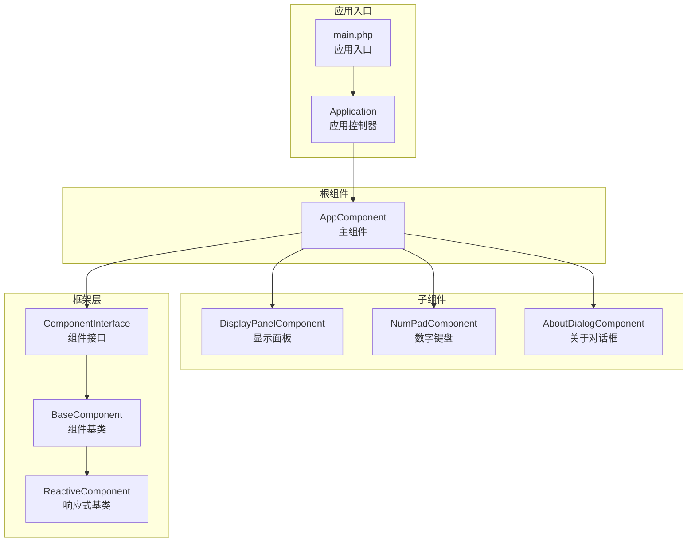
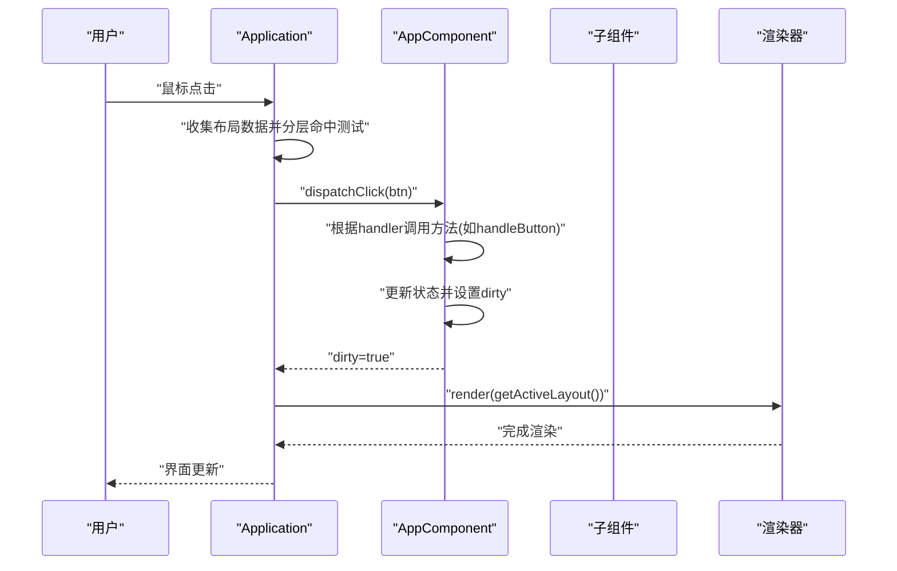
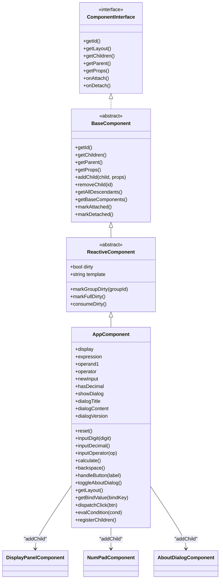
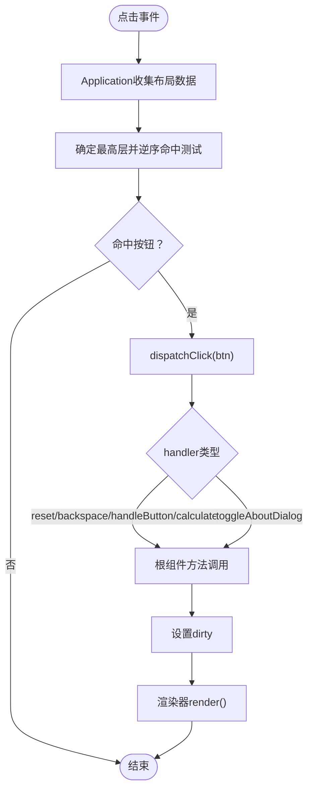
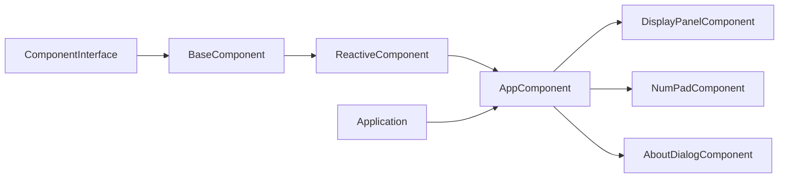

# 组件化架构设计

<cite>
**本文档引用的文件**
- [App.vue](file://apps/calculator/App.vue)
- [AppComponent.php](file://apps/calculator/gen/AppComponent.php)
- [DisplayPanel.vue](file://apps/calculator/components/DisplayPanel.vue)
- [DisplayPanelComponent.php](file://apps/calculator/gen/DisplayPanelComponent.php)
- [NumPad.vue](file://apps/calculator/components/NumPad.vue)
- [NumPadComponent.php](file://apps/calculator/gen/NumPadComponent.php)
- [AboutDialog.vue](file://apps/calculator/components/AboutDialog.vue)
- [AboutDialogComponent.php](file://apps/calculator/gen/AboutDialogComponent.php)
- [ComponentInterface.php](file://framework/interfaces/ComponentInterface.php)
- [BaseComponent.php](file://framework/BaseComponent.php)
- [ReactiveComponent.php](file://framework/ReactiveComponent.php)
- [Application.php](file://apps/calculator/Application.php)
- [main.php](file://apps/calculator/main.php)
</cite>

## 目录
1. [引言](#引言)
2. [项目结构](#项目结构)
3. [核心组件](#核心组件)
4. [架构总览](#架构总览)
5. [详细组件分析](#详细组件分析)
6. [依赖分析](#依赖分析)
7. [性能考虑](#性能考虑)
8. [故障排除指南](#故障排除指南)
9. [结论](#结论)
10. [附录](#附录)

## 引言
本文件面向VueCalc项目的组件化架构设计，系统阐述组件树结构、组件间通信与生命周期管理，重点解析主组件AppComponent的设计模式，并对DisplayPanel、NumPad、AboutDialog等子组件进行功能拆分与职责界定。同时，结合ComponentInterface接口与BaseComponent/ReactiveComponent基类，说明如何通过统一接口实现组件的可复用性与扩展性；解释组件嵌套关系与数据传递机制（props传递与事件冒泡），并给出组件开发最佳实践与扩展指南。

## 项目结构
VueCalc采用“模板驱动 + SFC编译 + 组件树”的架构：前端以.vue模板描述UI与交互，经SFC编译生成PHP组件类，运行时由Application统一调度与渲染。应用入口负责创建根组件、初始化渲染上下文并启动事件循环。

**图表来源**
- [main.php:19-48](file://apps/calculator/main.php#L19-L48)
- [Application.php:32-76](file://apps/calculator/Application.php#L32-L76)
- [AppComponent.php:11-11](file://apps/calculator/gen/AppComponent.php#L11-L11)
- [DisplayPanelComponent.php:11-11](file://apps/calculator/gen/DisplayPanelComponent.php#L11-L11)
- [NumPadComponent.php:11-11](file://apps/calculator/gen/NumPadComponent.php#L11-L11)
- [AboutDialogComponent.php:11-11](file://apps/calculator/gen/AboutDialogComponent.php#L11-L11)
- [ComponentInterface.php:13-52](file://framework/interfaces/ComponentInterface.php#L13-L52)
- [BaseComponent.php:16-177](file://framework/BaseComponent.php#L16-L177)
- [ReactiveComponent.php:14-90](file://framework/ReactiveComponent.php#L14-L90)

**章节来源**
- [main.php:19-48](file://apps/calculator/main.php#L19-L48)
- [Application.php:32-76](file://apps/calculator/Application.php#L32-L76)

## 核心组件
- 组件接口ComponentInterface：定义组件唯一标识、布局数据、子组件集合、父组件引用、属性配置、挂载/卸载回调等核心契约，确保AOT兼容与多实现支持。
- 组件基类BaseComponent：提供父子组件引用、子组件管理、属性设置、挂载状态与后代收集等通用能力。
- 响应式基类ReactiveComponent：在BaseComponent基础上增加脏标记、组级脏标记与全量脏标记、绑定值获取、点击分发、条件求值等响应式能力。
- 主组件AppComponent：作为根组件，声明业务状态（如display、expression等）、实现计算器核心算法、注册子组件并通过布局数据驱动渲染与事件分发。
- 子组件：DisplayPanelComponent（显示面板）、NumPadComponent（数字键盘）、AboutDialogComponent（关于对话框），各自提供布局数据与事件处理。

**章节来源**
- [ComponentInterface.php:13-52](file://framework/interfaces/ComponentInterface.php#L13-L52)
- [BaseComponent.php:16-177](file://framework/BaseComponent.php#L16-L177)
- [ReactiveComponent.php:14-90](file://framework/ReactiveComponent.php#L14-L90)
- [AppComponent.php:11-787](file://apps/calculator/gen/AppComponent.php#L11-L787)

## 架构总览
组件化架构围绕“数据驱动 + 事件驱动”展开：状态变更触发脏标记，Application按需渲染；用户点击通过Application收集布局并进行分层命中测试，再将事件分发至根组件，由根组件根据按钮配置调用对应方法，更新状态并触发重绘。

**图表来源**
- [Application.php:205-322](file://apps/calculator/Application.php#L205-L322)
- [AppComponent.php:731-750](file://apps/calculator/gen/AppComponent.php#L731-L750)

**章节来源**
- [Application.php:120-322](file://apps/calculator/Application.php#L120-L322)
- [AppComponent.php:194-670](file://apps/calculator/gen/AppComponent.php#L194-L670)

## 详细组件分析

### 主组件AppComponent设计模式
- 设计模式：数据驱动与事件驱动相结合。状态以业务属性形式声明，方法封装计算逻辑；布局数据以结构化数组形式返回，供渲染器使用；点击事件通过按钮配置映射到具体方法。
- 组件树注册：在构造函数中调用registerChildren，向根组件注册DisplayPanel、NumPad、AboutDialog三个子组件，并通过props传入相对偏移，形成嵌套布局。
- 生命周期：继承ReactiveComponent，实现onAttach/onDetach空实现；实际挂载由Application在initWindow阶段调用。
- 响应式更新：所有状态变更后设置$dirty，Application在事件循环中检测脏标记并触发渲染。
- 事件分发：dispatchClick根据按钮的handler字段调用根组件或子组件对应方法；evalCondition支持基于属性的条件渲染。

**图表来源**
- [ReactiveComponent.php:14-90](file://framework/ReactiveComponent.php#L14-L90)
- [BaseComponent.php:16-177](file://framework/BaseComponent.php#L16-L177)
- [ComponentInterface.php:13-52](file://framework/interfaces/ComponentInterface.php#L13-L52)
- [AppComponent.php:11-787](file://apps/calculator/gen/AppComponent.php#L11-L787)
- [DisplayPanelComponent.php:11-84](file://apps/calculator/gen/DisplayPanelComponent.php#L11-L84)
- [NumPadComponent.php:11-338](file://apps/calculator/gen/NumPadComponent.php#L11-L338)
- [AboutDialogComponent.php:11-216](file://apps/calculator/gen/AboutDialogComponent.php#L11-L216)

**章节来源**
- [AppComponent.php:11-787](file://apps/calculator/gen/AppComponent.php#L11-L787)
- [BaseComponent.php:78-105](file://framework/BaseComponent.php#L78-L105)
- [ReactiveComponent.php:37-64](file://framework/ReactiveComponent.php#L37-L64)

### 子组件：DisplayPanel（显示面板）
- 功能分工：负责显示当前数值与表达式，不处理点击事件。
- 布局数据：返回矩形背景与文本元素，文本绑定到value属性。
- 数据绑定：getBindValue根据bind键返回对应值；无条件渲染。
- 事件处理：无按钮，dispatchClick为空实现。

**章节来源**
- [DisplayPanel.vue:1-12](file://apps/calculator/components/DisplayPanel.vue#L1-L12)
- [DisplayPanelComponent.php:18-78](file://apps/calculator/gen/DisplayPanelComponent.php#L18-L78)

### 子组件：NumPad（数字键盘）
- 功能分工：提供数字、运算符、清除、退格、小数点等按键交互，委托根组件处理业务逻辑。
- 布局数据：返回18个按钮，每个按钮包含标签、尺寸、颜色、处理器与参数。
- 事件处理：dispatchClick根据handler调用reset/backspace/handleButton/calculate等方法。

**章节来源**
- [NumPad.vue:1-37](file://apps/calculator/components/NumPad.vue#L1-L37)
- [NumPadComponent.php:18-338](file://apps/calculator/gen/NumPadComponent.php#L18-L338)

### 子组件：AboutDialog（关于对话框）
- 功能分工：模态对话框，展示标题、内容、版本信息，提供关闭按钮。
- 布局数据：包含半透明覆盖层、对话框面板、标题、分割线、内容、版本号与关闭按钮。
- 条件渲染：通过condition字段与evalCondition配合，仅在showDialog为真时显示。
- 事件处理：关闭按钮调用toggleAboutDialog切换对话框状态。

**章节来源**
- [AboutDialog.vue:1-37](file://apps/calculator/components/AboutDialog.vue#L1-L37)
- [AboutDialogComponent.php:18-216](file://apps/calculator/gen/AboutDialogComponent.php#L18-L216)

### 组件接口ComponentInterface设计思路
- 统一契约：getId/getLayout/getChildren/getParent/getProps/onAttach/onDetach确保所有组件具备一致的树结构与生命周期行为。
- AOT友好：明确返回类型与无抽象类约束，便于静态编译与多实现扩展。
- 可复用性：通过getLayout返回标准化布局数据，Application统一收集与渲染；通过getProps与addChild建立父子关系，实现可组合的UI结构。

**章节来源**
- [ComponentInterface.php:13-52](file://framework/interfaces/ComponentInterface.php#L13-L52)

### 组件嵌套关系与数据传递机制
- 嵌套关系：AppComponent为根，通过addChild注册子组件并设置props中的x/y偏移，形成相对定位的组件树。
- 数据传递：
  - 属性传递：通过props传递位置偏移，Application在收集布局时累加偏移，保证子组件在全局坐标系中的正确位置。
  - 事件冒泡：Application收集所有按钮，按层叠顺序进行命中测试，将事件交由根组件dispatchClick处理，根组件再根据按钮配置调用相应方法。
  - 绑定渲染：根组件getBindValue根据bind键返回状态值，渲染器据此更新文本内容。

**图表来源**
- [Application.php:269-322](file://apps/calculator/Application.php#L269-L322)
- [AppComponent.php:731-750](file://apps/calculator/gen/AppComponent.php#L731-L750)

**章节来源**
- [Application.php:143-200](file://apps/calculator/Application.php#L143-L200)
- [AppComponent.php:676-681](file://apps/calculator/gen/AppComponent.php#L676-L681)

## 依赖分析
- 组件接口与基类：ComponentInterface定义契约，BaseComponent提供树结构与属性管理，ReactiveComponent扩展响应式能力。
- 根组件与子组件：AppComponent通过addChild建立父子关系，子组件各自实现getLayout与事件处理。
- 应用控制器：Application负责窗口初始化、组件挂载、布局收集、事件分发与渲染调度。

**图表来源**
- [ComponentInterface.php:13-52](file://framework/interfaces/ComponentInterface.php#L13-L52)
- [BaseComponent.php:16-177](file://framework/BaseComponent.php#L16-L177)
- [ReactiveComponent.php:14-90](file://framework/ReactiveComponent.php#L14-L90)
- [AppComponent.php:11-787](file://apps/calculator/gen/AppComponent.php#L11-L787)
- [Application.php:32-76](file://apps/calculator/Application.php#L32-L76)

**章节来源**
- [Application.php:82-112](file://apps/calculator/Application.php#L82-L112)
- [BaseComponent.php:84-105](file://framework/BaseComponent.php#L84-L105)

## 性能考虑
- 脏标记驱动渲染：仅在状态变更时触发渲染，降低无效重绘开销。
- 组级与全量脏标记：支持按组粒度更新，减少不必要的全量重绘。
- AOT友好实现：数组遍历使用索引循环、类型转换明确，提升编译期优化空间。
- 命中测试优化：分层命中测试先确定最高层，再逆序遍历，提高点击响应效率。

**章节来源**
- [ReactiveComponent.php:37-64](file://framework/ReactiveComponent.php#L37-L64)
- [Application.php:269-322](file://apps/calculator/Application.php#L269-L322)

## 故障排除指南
- 点击无响应：检查按钮的condition是否满足，确认Application的evalCondition与根组件evalCondition一致；核对按钮handler与对应方法名称。
- 界面不更新：确认状态变更后是否设置$dirty；检查Application事件循环中是否检测到dirty并调用render。
- 子组件未显示：检查子组件的condition与父组件状态；确认Application在收集布局时是否正确应用偏移。

**章节来源**
- [Application.php:269-322](file://apps/calculator/Application.php#L269-L322)
- [ReactiveComponent.php:56-64](file://framework/ReactiveComponent.php#L56-L64)

## 结论
VueCalc的组件化架构以ComponentInterface为契约，BaseComponent与ReactiveComponent为基石，AppComponent为核心协调者，配合Application实现数据驱动与事件驱动的统一调度。该设计既保证了AOT兼容性，又提供了良好的可扩展性与可维护性。通过标准化的布局数据与事件分发机制，开发者可以快速扩展新的组件类型与自定义组件。

## 附录

### 组件开发最佳实践
- 设计原则
  - 单一职责：每个组件聚焦单一功能域（如显示、输入、对话框）。
  - 可组合性：通过props传递偏移与配置，利用addChild构建组件树。
  - 响应式最小化：仅在必要状态变更时设置$dirty，避免频繁重绘。
- 命名规范
  - 组件类名：XxxComponent（如DisplayPanelComponent）。
  - 事件处理器：handleXxx（如handleButton）。
  - 状态属性：语义化命名（如display、expression、showDialog）。
- 代码组织
  - 将布局数据与事件处理分离，布局数据集中于getLayout，事件处理集中在dispatchClick。
  - 条件渲染统一通过evalCondition与condition字段实现。

### 扩展机制与新增组件指南
- 新增组件类型步骤
  - 定义组件类：继承ReactiveComponent，实现getLayout、getBindValue、dispatchClick、evalCondition。
  - 在根组件注册：在根组件构造或registerChildren中addChild并设置props偏移。
  - 配置按钮与条件：在布局数据中添加按钮项，设置handler与可选condition。
  - 状态联动：在根组件中新增状态属性，并在事件处理中更新状态与$dirty。
- 自定义组件示例
  - 参考DisplayPanelComponent（只读显示）与NumPadComponent（输入处理）的实现方式，按需选择是否实现按钮处理与条件渲染。

**章节来源**
- [AppComponent.php:676-701](file://apps/calculator/gen/AppComponent.php#L676-L701)
- [DisplayPanelComponent.php:18-78](file://apps/calculator/gen/DisplayPanelComponent.php#L18-L78)
- [NumPadComponent.php:18-338](file://apps/calculator/gen/NumPadComponent.php#L18-L338)
- [AboutDialogComponent.php:18-216](file://apps/calculator/gen/AboutDialogComponent.php#L18-L216)