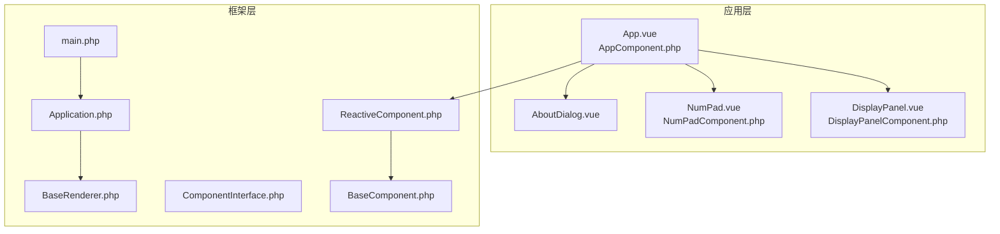
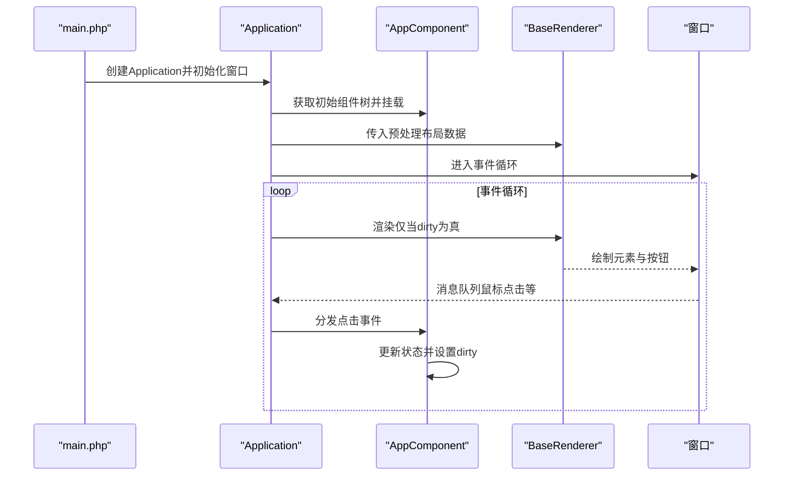
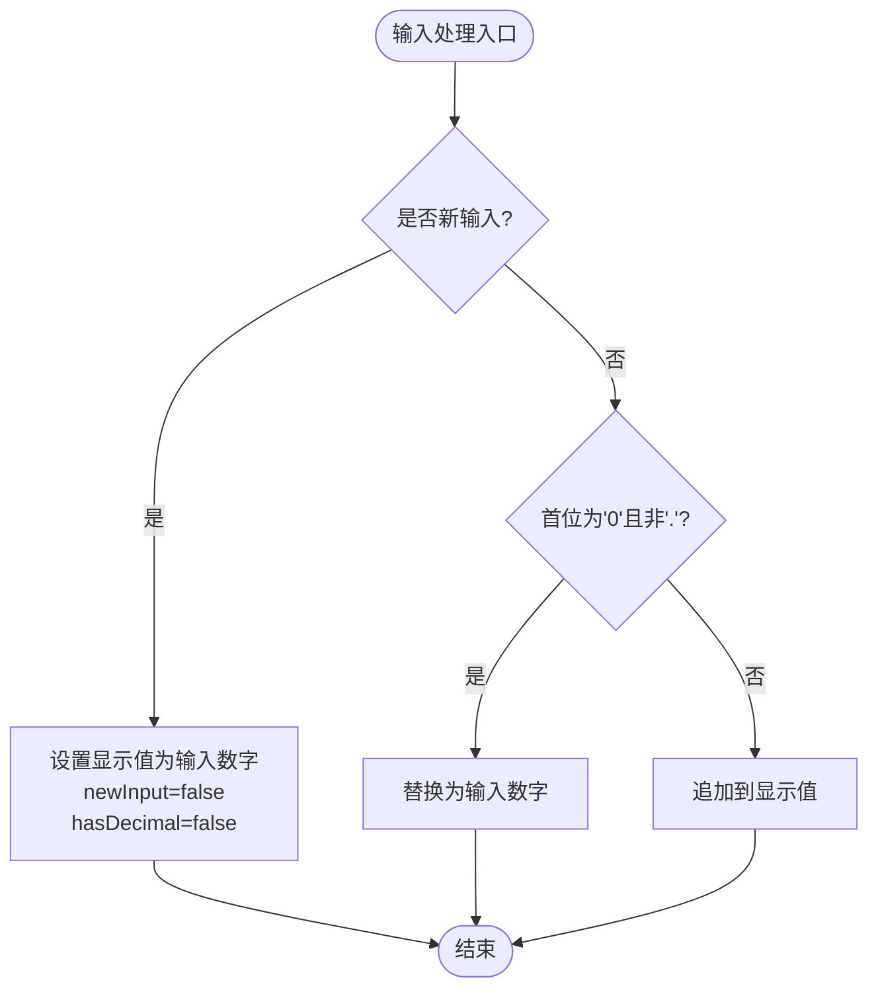
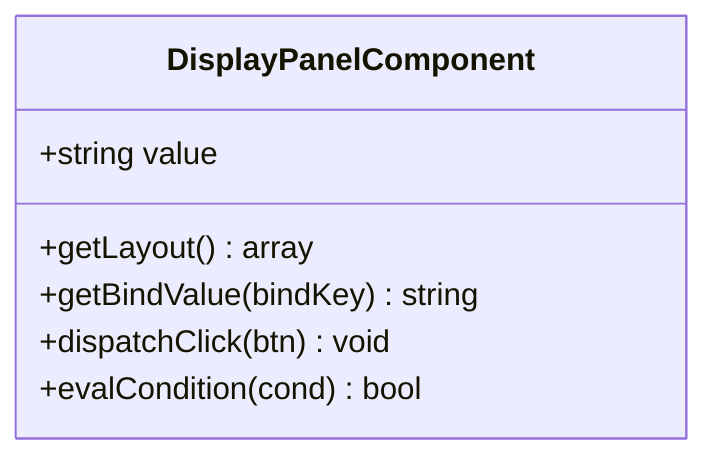
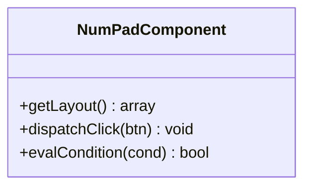
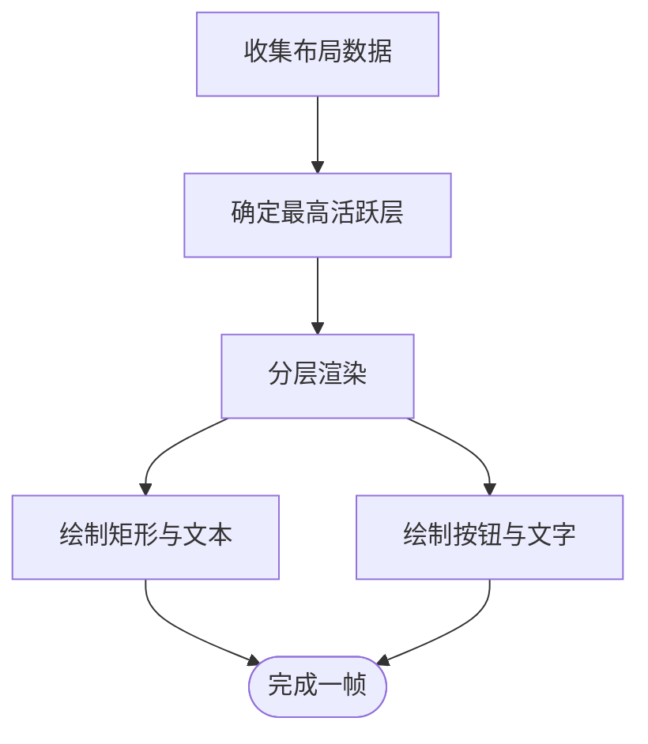
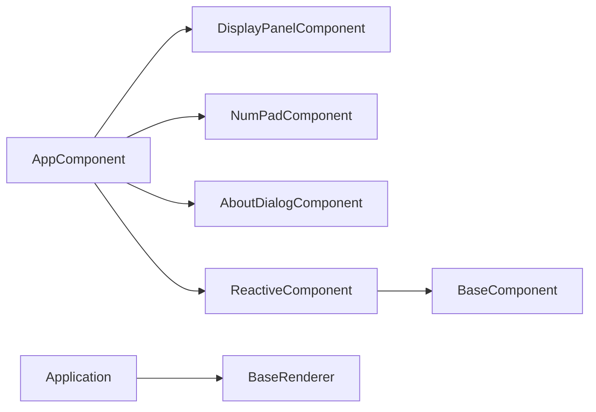

# 计算器核心功能

<cite>
**本文引用的文件**
- [App.vue](file://apps/calculator/App.vue)
- [AppComponent.php](file://apps/calculator/gen/AppComponent.php)
- [DisplayPanel.vue](file://apps/calculator/components/DisplayPanel.vue)
- [DisplayPanelComponent.php](file://apps/calculator/gen/DisplayPanelComponent.php)
- [NumPad.vue](file://apps/calculator/components/NumPad.vue)
- [NumPadComponent.php](file://apps/calculator/gen/NumPadComponent.php)
- [AboutDialog.vue](file://apps/calculator/components/AboutDialog.vue)
- [Application.php](file://apps/calculator/Application.php)
- [main.php](file://apps/calculator/main.php)
- [BaseComponent.php](file://framework/BaseComponent.php)
- [ReactiveComponent.php](file://framework/ReactiveComponent.php)
- [ComponentInterface.php](file://framework/interfaces/ComponentInterface.php)
- [BaseRenderer.php](file://framework/BaseRenderer.php)
</cite>

## 目录
1. [简介](#简介)
2. [项目结构](#项目结构)
3. [核心组件](#核心组件)
4. [架构总览](#架构总览)
5. [详细组件分析](#详细组件分析)
6. [依赖关系分析](#依赖关系分析)
7. [性能考量](#性能考量)
8. [故障排查指南](#故障排查指南)
9. [结论](#结论)
10. [附录：扩展指南](#附录扩展指南)

## 简介
本文件面向VueCalc计算器应用，系统梳理其核心功能实现，包括：
- 四则运算与表达式管理
- 输入处理机制（连续输入、小数点、输入验证）
- 运算符处理（优先级、解析与计算顺序）
- 结果显示逻辑（格式化、精度控制、错误处理）
- 状态管理（操作数存储、运算符缓存、输入状态跟踪）
- 扩展指南（新增运算功能与自定义操作）

目标是帮助开发者快速理解代码架构与实现细节，并提供可操作的扩展方案。

## 项目结构
VueCalc采用SFC（Single File Component）+ AOT（Ahead-of-Time）编译链路，核心目录如下：
- apps/calculator：应用层，包含组件模板与入口
- apps/calculator/gen：SFC编译器生成的PHP组件类
- apps/calculator/components：原始SFC组件
- framework：通用组件框架与渲染器
- docs：技术文档与规划

图表来源
- [AppComponent.php:11-787](file://apps/calculator/gen/AppComponent.php#L11-L787)
- [DisplayPanelComponent.php:11-84](file://apps/calculator/gen/DisplayPanelComponent.php#L11-L84)
- [NumPadComponent.php:11-338](file://apps/calculator/gen/NumPadComponent.php#L11-L338)
- [Application.php:15-322](file://apps/calculator/Application.php#L15-L322)
- [main.php:19-48](file://apps/calculator/main.php#L19-L48)
- [BaseComponent.php:16-177](file://framework/BaseComponent.php#L16-L177)
- [ReactiveComponent.php:14-90](file://framework/ReactiveComponent.php#L14-L90)
- [ComponentInterface.php:13-52](file://framework/interfaces/ComponentInterface.php#L13-L52)
- [BaseRenderer.php:15-197](file://framework/BaseRenderer.php#L15-L197)

章节来源
- [main.php:19-48](file://apps/calculator/main.php#L19-L48)
- [Application.php:51-76](file://apps/calculator/Application.php#L51-L76)

## 核心组件
- App/AppComponent：应用主控，负责状态与业务逻辑（显示值、表达式、操作数、运算符、输入状态），以及按钮事件分发与渲染脏标记。
- DisplayPanel/DisplayPanelComponent：显示面板子组件，绑定显示值。
- NumPad/NumPadComponent：数字键盘子组件，提供按钮布局与事件转发。
- AboutDialog：关于弹窗，受App状态控制显示。
- Application：应用控制器，负责窗口初始化、事件循环、布局收集与渲染调度。
- BaseComponent/ReactiveComponent：组件基类与响应式基类，提供组件树管理、脏标记与绑定值获取。
- BaseRenderer：渲染器，按层级分层渲染元素与按钮，支持条件显示与文本对齐。

章节来源
- [App.vue:27-63](file://apps/calculator/App.vue#L27-L63)
- [AppComponent.php:13-50](file://apps/calculator/gen/AppComponent.php#L13-L50)
- [DisplayPanel.vue:1-12](file://apps/calculator/components/DisplayPanel.vue#L1-L12)
- [NumPad.vue:1-37](file://apps/calculator/components/NumPad.vue#L1-L37)
- [Application.php:15-322](file://apps/calculator/Application.php#L15-L322)
- [BaseComponent.php:16-177](file://framework/BaseComponent.php#L16-L177)
- [ReactiveComponent.php:14-90](file://framework/ReactiveComponent.php#L14-L90)
- [BaseRenderer.php:98-197](file://framework/BaseRenderer.php#L98-L197)

## 架构总览
应用启动流程与交互序列如下：

图表来源
- [main.php:19-48](file://apps/calculator/main.php#L19-L48)
- [Application.php:51-76](file://apps/calculator/Application.php#L51-L76)
- [Application.php:205-261](file://apps/calculator/Application.php#L205-L261)
- [BaseRenderer.php:98-197](file://framework/BaseRenderer.php#L98-L197)

## 详细组件分析

### App/AppComponent：状态与业务逻辑
- 状态字段
  - display：当前显示值（字符串）
  - expression：表达式文本（右上角）
  - operand1：第一个操作数
  - operator：当前运算符
  - newInput：是否开始新输入
  - hasDecimal：是否已输入小数点
  - showDialog/dialog*：关于弹窗状态与文案
- 核心方法
  - reset：重置所有状态
  - inputDigit：数字输入处理（连续输入、首位零处理、小数点状态）
  - inputDecimal：小数点输入处理（首次输入补零、去重）
  - inputOperator：运算符输入（触发计算、缓存操作数与运算符、更新表达式）
  - calculate：执行四则运算（含除零保护）、格式化输出、重置状态
  - backspace：退格删除（末位小数点清除hasDecimal）
  - handleButton：统一按钮分发入口
  - toggleAboutDialog：切换关于弹窗
- 脏标记
  - 每次状态变更后设置$dirty以触发重绘

图表来源
- [App.vue:65-79](file://apps/calculator/App.vue#L65-L79)
- [AppComponent.php:52-81](file://apps/calculator/gen/AppComponent.php#L52-L81)

章节来源
- [App.vue:54-186](file://apps/calculator/App.vue#L54-L186)
- [AppComponent.php:40-181](file://apps/calculator/gen/AppComponent.php#L40-L181)

### DisplayPanel/DisplayPanelComponent：显示面板
- 绑定显示值到文本元素，右对齐，容器内右边界对齐
- 文本长度超过阈值时动态缩小字号，保证可见性

图表来源
- [DisplayPanel.vue:1-12](file://apps/calculator/components/DisplayPanel.vue#L1-L12)
- [DisplayPanelComponent.php:11-84](file://apps/calculator/gen/DisplayPanelComponent.php#L11-L84)

章节来源
- [DisplayPanel.vue:1-12](file://apps/calculator/components/DisplayPanel.vue#L1-L12)
- [DisplayPanelComponent.php:18-84](file://apps/calculator/gen/DisplayPanelComponent.php#L18-L84)

### NumPad/NumPadComponent：数字键盘
- 提供18个按钮布局，包含数字、运算符、清屏、退格、小数点与等号
- 事件转发：将按钮标签作为参数调用App.handleButton或直接调用App.calculate/reset/backspace

图表来源
- [NumPad.vue:1-37](file://apps/calculator/components/NumPad.vue#L1-L37)
- [NumPadComponent.php:11-338](file://apps/calculator/gen/NumPadComponent.php#L11-L338)

章节来源
- [NumPad.vue:1-37](file://apps/calculator/components/NumPad.vue#L1-L37)
- [NumPadComponent.php:18-338](file://apps/calculator/gen/NumPadComponent.php#L18-L338)

### AboutDialog：关于弹窗
- 半透明覆盖层与对话框面板
- 条件显示：受App.showDialog控制
- 关闭按钮切换showDialog

章节来源
- [AboutDialog.vue:1-37](file://apps/calculator/components/AboutDialog.vue#L1-L37)

### Application：应用控制器
- 窗口初始化与事件循环
- 布局收集：递归遍历组件树，应用偏移，生成elements/buttons
- 点击分发：命中测试（按层从高到低逆序），匹配条件后调用根组件dispatchClick
- 渲染调度：仅在dirty为真时调用渲染器

图表来源
- [Application.php:120-200](file://apps/calculator/Application.php#L120-L200)
- [Application.php:269-311](file://apps/calculator/Application.php#L269-L311)
- [BaseRenderer.php:98-197](file://framework/BaseRenderer.php#L98-L197)

章节来源
- [Application.php:51-76](file://apps/calculator/Application.php#L51-L76)
- [Application.php:205-261](file://apps/calculator/Application.php#L205-L261)

### 渲染器与组件基类
- BaseRenderer：两阶段分层渲染，支持条件显示、文本对齐与动态字号
- ReactiveComponent：响应式状态管理，脏标记与分组脏标记
- BaseComponent：组件树结构与生命周期

章节来源
- [BaseRenderer.php:98-197](file://framework/BaseRenderer.php#L98-L197)
- [ReactiveComponent.php:14-90](file://framework/ReactiveComponent.php#L14-L90)
- [BaseComponent.php:16-177](file://framework/BaseComponent.php#L16-L177)
- [ComponentInterface.php:13-52](file://framework/interfaces/ComponentInterface.php#L13-L52)

## 依赖关系分析
- 组件依赖
  - AppComponent依赖DisplayPanelComponent、NumPadComponent、AboutDialogComponent
  - ReactiveComponent继承BaseComponent，实现ComponentInterface
- 控制流
  - Application收集布局并驱动渲染
  - 点击事件从Application分发到AppComponent，再由App处理状态变更与脏标记
- 错误处理
  - 除零时显示错误提示并清理状态

图表来源
- [AppComponent.php:676-701](file://apps/calculator/gen/AppComponent.php#L676-L701)
- [ReactiveComponent.php:14-90](file://framework/ReactiveComponent.php#L14-L90)
- [BaseComponent.php:16-177](file://framework/BaseComponent.php#L16-L177)
- [Application.php:15-322](file://apps/calculator/Application.php#L15-L322)
- [BaseRenderer.php:15-197](file://framework/BaseRenderer.php#L15-L197)

章节来源
- [AppComponent.php:676-701](file://apps/calculator/gen/AppComponent.php#L676-L701)
- [Application.php:15-322](file://apps/calculator/Application.php#L15-L322)

## 性能考量
- 脏标记驱动渲染：仅在状态变更后重绘，避免不必要的重绘
- AOT兼容的遍历方式：使用array_keys()+for循环替代foreach，减少类型推断问题
- 文本渲染优化：根据字符长度动态调整字号，提升长数字可读性
- 事件循环节流：固定睡眠时间维持约60FPS

章节来源
- [ReactiveComponent.php:56-64](file://framework/ReactiveComponent.php#L56-L64)
- [BaseRenderer.php:55-90](file://framework/BaseRenderer.php#L55-L90)
- [Application.php:259](file://apps/calculator/Application.php#L259)

## 故障排查指南
- 显示异常
  - 检查App/Component中的状态字段是否正确更新（display/expression/operand1/operator/newInput/hasDecimal）
  - 确认handleButton与dispatchClick的调用链是否正确
- 无法点击
  - 检查Application的点击命中测试与条件判断
  - 确认按钮的layer与condition配置
- 除零错误
  - 检查calculate中的除零分支与错误状态清理
- 渲染不更新
  - 确认每次状态变更后设置了$dirty

章节来源
- [App.vue:167-186](file://apps/calculator/App.vue#L167-L186)
- [AppComponent.php:162-181](file://apps/calculator/gen/AppComponent.php#L162-L181)
- [Application.php:269-311](file://apps/calculator/Application.php#L269-L311)
- [Application.php:97-112](file://apps/calculator/Application.php#L97-L112)

## 结论
VueCalc通过SFC+AOT架构实现了简洁高效的计算器应用。其核心优势在于：
- 清晰的状态管理与事件分发
- 响应式渲染与脏标记机制
- 可扩展的组件体系与条件渲染
- 稳健的错误处理与显示优化

该设计为后续扩展新运算与自定义操作提供了良好基础。

## 附录：扩展指南

### 新增四则运算
- 在App/Component中扩展运算分支（如支持“%”取余），并在calculate中处理
- 更新按钮布局与事件映射，确保label与处理函数一致
- 注意除零保护与结果格式化策略

章节来源
- [App.vue:94-147](file://apps/calculator/App.vue#L94-L147)
- [AppComponent.php:83-140](file://apps/calculator/gen/AppComponent.php#L83-L140)

### 自定义显示格式
- 在calculate中调整结果格式化策略（如科学计数、固定位数）
- 在DisplayPanel/Component中优化文本对齐与字号策略

章节来源
- [App.vue:136-140](file://apps/calculator/App.vue#L136-L140)
- [DisplayPanel.vue:1-12](file://apps/calculator/components/DisplayPanel.vue#L1-L12)

### 添加新功能按钮
- 在NumPad/Component中增加按钮布局与事件映射
- 在App/Component中新增对应处理方法，并在handleButton中路由
- 如需条件显示，利用条件渲染机制

章节来源
- [NumPad.vue:1-37](file://apps/calculator/components/NumPad.vue#L1-L37)
- [NumPadComponent.php:18-338](file://apps/calculator/gen/NumPadComponent.php#L18-L338)
- [App.vue:167-186](file://apps/calculator/App.vue#L167-L186)