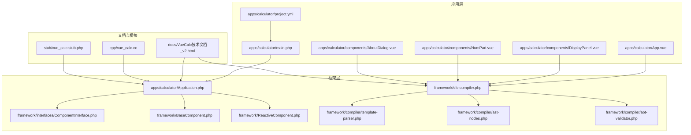
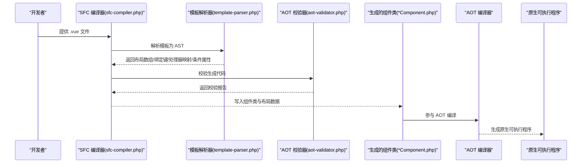
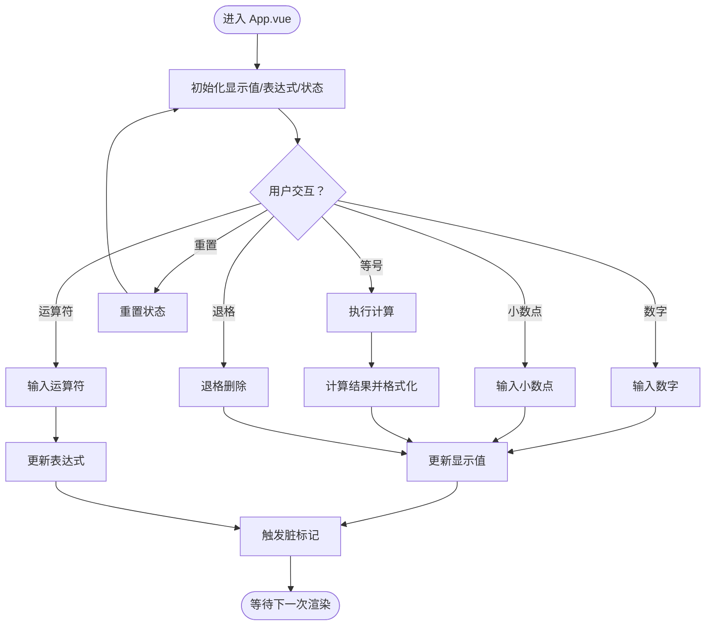
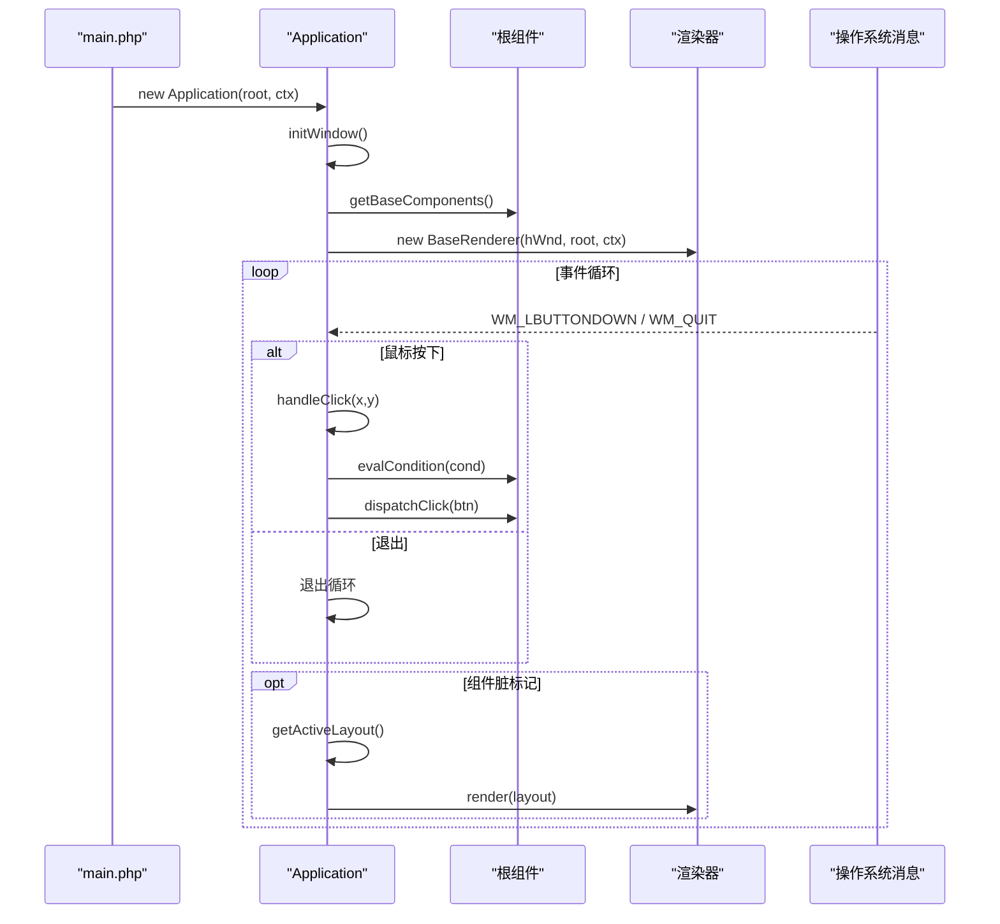
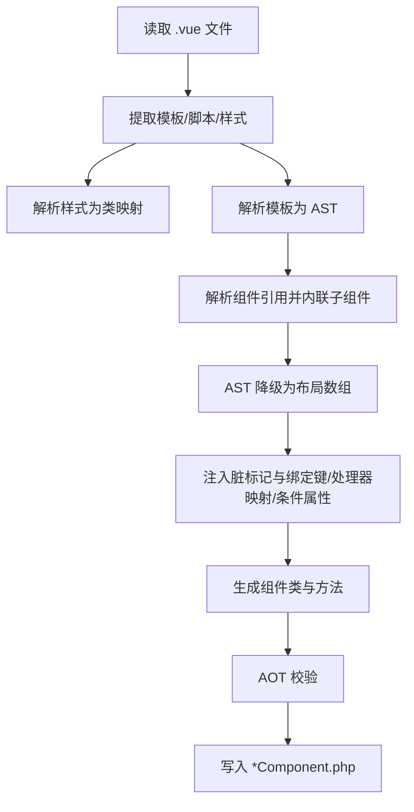
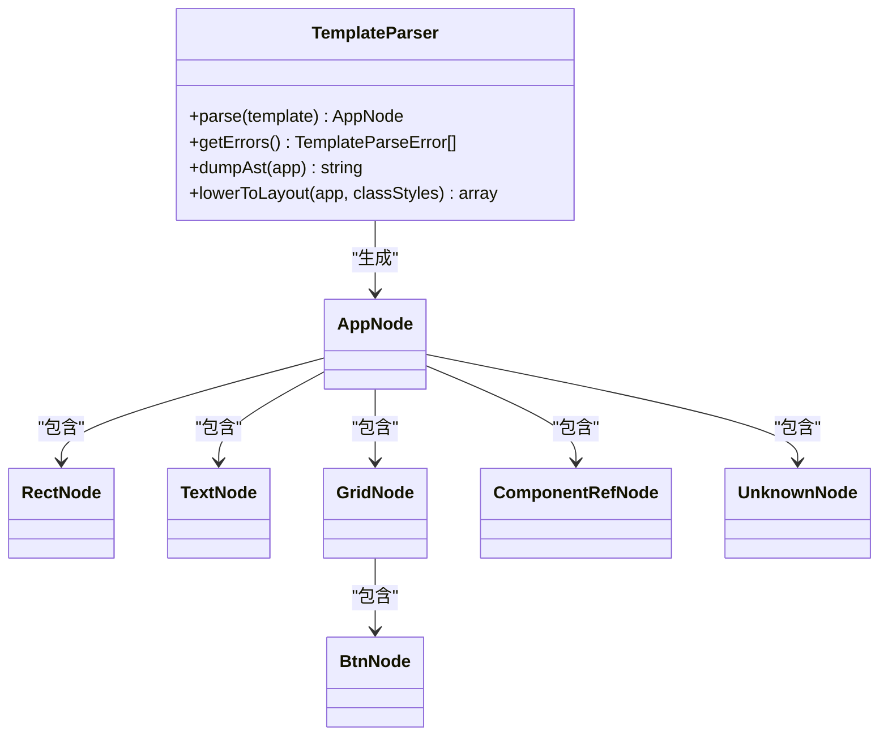
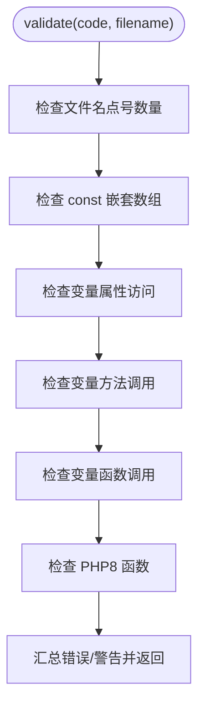
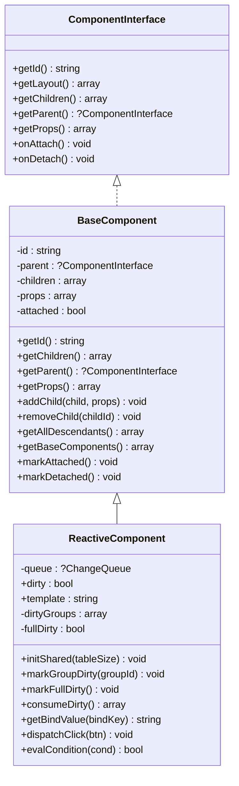
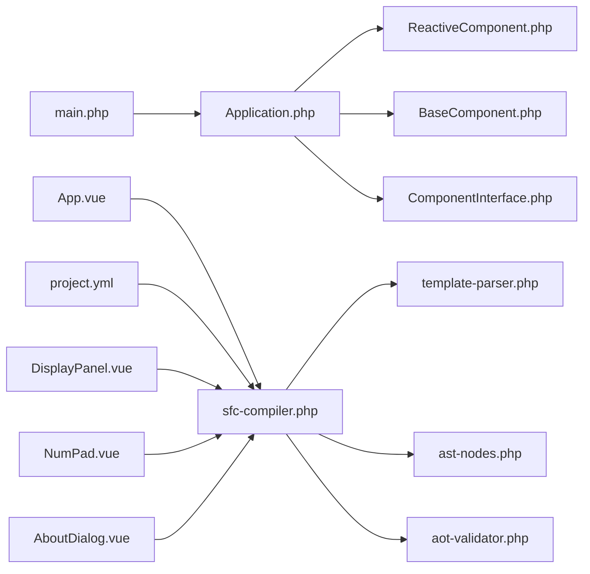

# 项目介绍

<cite>
**本文引用的文件**
- [apps/calculator/App.vue](file://apps/calculator/App.vue)
- [apps/calculator/Application.php](file://apps/calculator/Application.php)
- [apps/calculator/main.php](file://apps/calculator/main.php)
- [apps/calculator/project.yml](file://apps/calculator/project.yml)
- [apps/calculator/components/DisplayPanel.vue](file://apps/calculator/components/DisplayPanel.vue)
- [apps/calculator/components/NumPad.vue](file://apps/calculator/components/NumPad.vue)
- [apps/calculator/components/AboutDialog.vue](file://apps/calculator/components/AboutDialog.vue)
- [framework/sfc-compiler.php](file://framework/sfc-compiler.php)
- [framework/compiler/template-parser.php](file://framework/compiler/template-parser.php)
- [framework/compiler/ast-nodes.php](file://framework/compiler/ast-nodes.php)
- [framework/compiler/aot-validator.php](file://framework/compiler/aot-validator.php)
- [framework/BaseComponent.php](file://framework/BaseComponent.php)
- [framework/ReactiveComponent.php](file://framework/ReactiveComponent.php)
- [framework/interfaces/ComponentInterface.php](file://framework/interfaces/ComponentInterface.php)
- [docs/VueCalc技术文档_v2.html](file://docs/VueCalc技术文档_v2.html)
</cite>

## 目录
1. [引言](#引言)
2. [项目结构](#项目结构)
3. [核心组件](#核心组件)
4. [架构总览](#架构总览)
5. [详细组件分析](#详细组件分析)
6. [依赖关系分析](#依赖关系分析)
7. [性能考量](#性能考量)
8. [故障排查指南](#故障排查指南)
9. [结论](#结论)
10. [附录](#附录)

## 引言
VueCalc 是一个基于 PHP 的单文件组件（SFC）桌面应用程序框架，其核心定位是将 Vue.js 风格的组件开发体验引入桌面应用开发领域，并通过 Swoole AOT（Ahead-of-Time）编译技术，将 PHP 代码编译为原生 Windows x64 可执行程序。项目以“数据驱动 UI”的理念为核心，强调组件化的 UI 描述语言与 PHP 业务逻辑的结合，借助 C++ GDI 渲染层实现高性能、低开销的桌面界面。

价值主张包括：
- 以 Vue 风格的模板语法描述 UI，降低学习成本与心智负担；
- 通过 SFC 编译器将模板/脚本/样式一次性编译为 PHP 组件类与布局数据，提升运行时性能；
- 依托 AOT 编译器生成原生可执行文件，避免运行时解释或 JIT 的不确定性；
- 提供组件注册表与组件解析机制，支持子组件内联与层级布局；
- 通过脏标记与条件渲染等机制，实现最小化重绘与高效事件分发。

## 项目结构
项目采用“应用 + 框架 + 文档”三层组织方式：
- apps：包含具体应用与示例，如计算器应用及其组件；
- framework：包含编译器、运行时组件基类、渲染上下文与接口定义；
- docs：包含技术文档、规划文档与构建流程参考；
- cpp 与 stub：提供 C++ 桥接层与 PHP 扩展桩文件，支撑 AOT 编译与系统调用。

**图示来源**
- [apps/calculator/main.php:1-48](file://apps/calculator/main.php#L1-L48)
- [apps/calculator/App.vue:1-203](file://apps/calculator/App.vue#L1-L203)
- [apps/calculator/components/DisplayPanel.vue:1-12](file://apps/calculator/components/DisplayPanel.vue#L1-L12)
- [apps/calculator/components/NumPad.vue:1-37](file://apps/calculator/components/NumPad.vue#L1-L37)
- [apps/calculator/components/AboutDialog.vue:1-37](file://apps/calculator/components/AboutDialog.vue#L1-L37)
- [apps/calculator/project.yml:1-34](file://apps/calculator/project.yml#L1-L34)
- [framework/sfc-compiler.php:1-819](file://framework/sfc-compiler.php#L1-L819)
- [framework/compiler/template-parser.php:1-869](file://framework/compiler/template-parser.php#L1-L869)
- [framework/compiler/ast-nodes.php:1-211](file://framework/compiler/ast-nodes.php#L1-L211)
- [framework/compiler/aot-validator.php:1-207](file://framework/compiler/aot-validator.php#L1-L207)
- [framework/BaseComponent.php:1-177](file://framework/BaseComponent.php#L1-L177)
- [framework/ReactiveComponent.php:1-90](file://framework/ReactiveComponent.php#L1-L90)
- [framework/interfaces/ComponentInterface.php:1-52](file://framework/interfaces/ComponentInterface.php#L1-L52)
- [docs/VueCalc技术文档_v2.html:1-200](file://docs/VueCalc技术文档_v2.html#L1-L200)

**章节来源**
- [apps/calculator/project.yml:1-34](file://apps/calculator/project.yml#L1-L34)
- [docs/VueCalc技术文档_v2.html:139-194](file://docs/VueCalc技术文档_v2.html#L139-L194)

## 核心组件
- 组件接口与基类
  - ComponentInterface：定义组件的标识、布局获取、父子关系、属性与生命周期回调；
  - BaseComponent：提供组件树结构、子组件管理、属性配置与后代收集；
  - ReactiveComponent：在基类基础上增加脏标记、分组脏标记与全量脏标记，以及绑定值获取、按钮点击分发、条件求值等抽象方法。
- 应用控制器
  - Application：负责窗口初始化、事件循环、布局收集与渲染器集成；支持组件树挂载、动态偏移应用与点击分发。
- SFC 编译器
  - sfc-compiler：从 .vue 文件提取模板/脚本/样式，解析模板为 AST，解析样式为 CSS 映射，生成组件类与布局数据，并进行 AOT 校验。
- 模板解析器
  - template-parser：递归下降解析器，支持 rect/text/grid/btn 与自定义组件引用节点，生成布局数组与绑定键、处理器映射、条件属性集合。
- AOT 校验器
  - aot-validator：在生成 .php 文件前进行 AOT 兼容性检查，避免变量属性访问、变量方法调用、变量函数调用等导致编译失败的问题。

**章节来源**
- [framework/interfaces/ComponentInterface.php:13-52](file://framework/interfaces/ComponentInterface.php#L13-L52)
- [framework/BaseComponent.php:16-177](file://framework/BaseComponent.php#L16-L177)
- [framework/ReactiveComponent.php:14-90](file://framework/ReactiveComponent.php#L14-L90)
- [apps/calculator/Application.php:15-322](file://apps/calculator/Application.php#L15-L322)
- [framework/sfc-compiler.php:1-819](file://framework/sfc-compiler.php#L1-L819)
- [framework/compiler/template-parser.php:61-869](file://framework/compiler/template-parser.php#L61-L869)
- [framework/compiler/aot-validator.php:18-207](file://framework/compiler/aot-validator.php#L18-L207)

## 架构总览
VueCalc 的整体架构围绕“SFC 编译器 → 组件类 + 布局数据 → AOT 编译 → 原生可执行程序”的流水线展开。应用入口通过 main.php 创建根组件与渲染上下文，交由 Application 控制器完成窗口初始化、事件循环与渲染调度。模板解析器将 .vue 中的模板转换为布局数组，脚本分析器注入脏标记逻辑，样式解析器将 CSS 类映射为 GDI 属性，最终由 AOT 校验器保证生成代码满足编译约束。

**图示来源**
- [framework/sfc-compiler.php:227-601](file://framework/sfc-compiler.php#L227-L601)
- [framework/compiler/template-parser.php:88-686](file://framework/compiler/template-parser.php#L88-L686)
- [framework/compiler/aot-validator.php:37-121](file://framework/compiler/aot-validator.php#L37-L121)

**章节来源**
- [docs/VueCalc技术文档_v2.html:162-194](file://docs/VueCalc技术文档_v2.html#L162-L194)
- [framework/sfc-compiler.php:1-25](file://framework/sfc-compiler.php#L1-L25)

## 详细组件分析

### 计算器应用组件（App.vue）
- 角色：根组件，承载显示面板、数字键盘、关于弹窗与交互逻辑；
- 数据与行为：包含显示值、表达式、操作数、运算符、输入状态与对话框状态等属性；提供重置、输入数字/小数点、运算符输入、计算、退格与按钮处理等方法；
- 模板结构：包含背景矩形、显示面板子组件、表达式文本、数字键盘子组件、关于按钮与关于弹窗子组件；支持 v-if 条件渲染与 overlay 弹窗层；
- 样式：通过 CSS 类控制背景、字体大小与颜色等视觉属性。

**图示来源**
- [apps/calculator/App.vue:25-194](file://apps/calculator/App.vue#L25-L194)

**章节来源**
- [apps/calculator/App.vue:1-203](file://apps/calculator/App.vue#L1-L203)

### 应用控制器（Application.php）
- 角色：应用生命周期与事件循环的中枢，负责窗口创建、组件挂载、布局收集与渲染调度；
- 关键流程：initWindow 创建窗口并挂载根组件的初始组件树；run 进入事件循环，处理鼠标点击并分发到根组件；根据脏标记决定是否重绘；
- 布局收集：递归遍历组件树，动态应用子组件的 x/y 偏移，合并 elements/buttons；
- 点击分发：按层叠顺序进行命中测试，命中后调用 dispatchClick，最终由根组件的 dispatchClick 方法处理。

**图示来源**
- [apps/calculator/Application.php:32-322](file://apps/calculator/Application.php#L32-L322)
- [apps/calculator/main.php:19-48](file://apps/calculator/main.php#L19-L48)

**章节来源**
- [apps/calculator/Application.php:15-322](file://apps/calculator/Application.php#L15-L322)
- [apps/calculator/main.php:1-48](file://apps/calculator/main.php#L1-L48)

### SFC 编译器（sfc-compiler.php）
- 角色：将 .vue 文件编译为 PHP 组件类与布局数据，生成 registerChildren/getBaseComponents/getLayout/dispatchClick/evalCondition 等方法；
- 关键步骤：提取模板/脚本/样式块；解析样式为类映射；解析模板为 AST；解析组件引用并内联子组件；生成布局数组；注入脏标记；生成 getBindValue/dispatchClick/evalCondition；AOT 校验；写入文件；
- v6 M2 变更：输出文件名改为 *Component.php；主组件生成 registerChildren()/getBaseComponents()；不再生成 AppLayout_gen.php。

**图示来源**
- [framework/sfc-compiler.php:262-601](file://framework/sfc-compiler.php#L262-L601)

**章节来源**
- [framework/sfc-compiler.php:1-819](file://framework/sfc-compiler.php#L1-L819)

### 模板解析器（template-parser.php）
- 角色：递归下降解析器，支持 rect/text/grid/btn 与自定义组件引用节点；
- 关键能力：词法分析（Tokenize）、语法分析（Recursive Descent）、AST 降级（Lowering）为布局数组；收集绑定键、处理器映射与条件属性；解析 v-if 条件；
- 错误处理：收集 TemplateParseError 并保留未知节点以便后续处理。

**图示来源**
- [framework/compiler/template-parser.php:61-869](file://framework/compiler/template-parser.php#L61-L869)
- [framework/compiler/ast-nodes.php:9-211](file://framework/compiler/ast-nodes.php#L9-L211)

**章节来源**
- [framework/compiler/template-parser.php:61-869](file://framework/compiler/template-parser.php#L61-L869)
- [framework/compiler/ast-nodes.php:1-211](file://framework/compiler/ast-nodes.php#L1-L211)

### AOT 校验器（aot-validator.php）
- 角色：在写入生成文件前进行 AOT 兼容性检查，避免变量属性/方法/函数调用、const 嵌套数组、PHP8 函数等导致编译失败；
- 规则：文件名点号限制、禁止变量属性/方法/函数调用、推荐使用 strpos/strncmp/substr 等替代 str_contains/str_starts_with/str_ends_with/array_is_list、禁止 const 嵌套数组等。

**图示来源**
- [framework/compiler/aot-validator.php:37-121](file://framework/compiler/aot-validator.php#L37-L121)

**章节来源**
- [framework/compiler/aot-validator.php:18-207](file://framework/compiler/aot-validator.php#L18-L207)

### 组件基类与接口（BaseComponent/ReactiveComponent/ComponentInterface）
- ComponentInterface：定义组件的标识、布局获取、父子关系、属性与生命周期回调；
- BaseComponent：提供组件树结构、子组件管理、属性配置与后代收集；
- ReactiveComponent：在基类基础上增加脏标记、分组脏标记与全量脏标记，以及绑定值获取、按钮点击分发、条件求值等抽象方法。

**图示来源**
- [framework/interfaces/ComponentInterface.php:13-52](file://framework/interfaces/ComponentInterface.php#L13-L52)
- [framework/BaseComponent.php:16-177](file://framework/BaseComponent.php#L16-L177)
- [framework/ReactiveComponent.php:14-90](file://framework/ReactiveComponent.php#L14-L90)

**章节来源**
- [framework/interfaces/ComponentInterface.php:1-52](file://framework/interfaces/ComponentInterface.php#L1-L52)
- [framework/BaseComponent.php:1-177](file://framework/BaseComponent.php#L1-L177)
- [framework/ReactiveComponent.php:1-90](file://framework/ReactiveComponent.php#L1-L90)

### 子组件示例
- DisplayPanel.vue：展示面板子组件，包含背景矩形与右侧对齐的文本绑定；
- NumPad.vue：数字键盘子组件，使用 grid + btn 构成 4×5 按钮网格；
- AboutDialog.vue：关于弹窗子组件，支持半透明覆盖层与 v-if 条件渲染。

**章节来源**
- [apps/calculator/components/DisplayPanel.vue:1-12](file://apps/calculator/components/DisplayPanel.vue#L1-L12)
- [apps/calculator/components/NumPad.vue:1-37](file://apps/calculator/components/NumPad.vue#L1-L37)
- [apps/calculator/components/AboutDialog.vue:1-37](file://apps/calculator/components/AboutDialog.vue#L1-L37)

## 依赖关系分析
- 应用入口依赖 Application 控制器与渲染上下文；
- 根组件依赖 ReactiveComponent 基类与脏标记机制；
- SFC 编译器依赖模板解析器、AST 节点定义与 AOT 校验器；
- 模板解析器依赖 AST 节点与组件注册表；
- 组件注册表在 project.yml 中声明，供编译器解析组件引用。

**图示来源**
- [apps/calculator/main.php:19-48](file://apps/calculator/main.php#L19-L48)
- [apps/calculator/Application.php:32-322](file://apps/calculator/Application.php#L32-L322)
- [framework/ReactiveComponent.php:14-90](file://framework/ReactiveComponent.php#L14-L90)
- [framework/BaseComponent.php:16-177](file://framework/BaseComponent.php#L16-L177)
- [framework/interfaces/ComponentInterface.php:13-52](file://framework/interfaces/ComponentInterface.php#L13-L52)
- [framework/sfc-compiler.php:28-36](file://framework/sfc-compiler.php#L28-L36)
- [framework/compiler/template-parser.php:16-18](file://framework/compiler/template-parser.php#L16-L18)
- [framework/compiler/ast-nodes.php:1-8](file://framework/compiler/ast-nodes.php#L1-L8)
- [framework/compiler/aot-validator.php:18-207](file://framework/compiler/aot-validator.php#L18-L207)
- [apps/calculator/project.yml:29-34](file://apps/calculator/project.yml#L29-L34)

**章节来源**
- [apps/calculator/project.yml:1-34](file://apps/calculator/project.yml#L1-L34)
- [framework/sfc-compiler.php:40-89](file://framework/sfc-compiler.php#L40-L89)

## 性能考量
- 编译期优化：模板解析与布局数组生成在编译阶段完成，运行时仅需加载组件类与布局数据，减少运行时解析开销；
- 数据驱动渲染：通过脏标记与分组脏标记，仅在状态变化时触发重绘，降低无效绘制；
- 坐标计算：按钮坐标在编译期完成，运行时仅需叠加偏移，避免重复计算；
- AOT 兼容：严格遵循 AOT 约束，避免反射、魔术方法与变量函数调用，确保编译稳定性与运行时性能。

[本节为通用性能讨论，无需列出具体文件来源]

## 故障排查指南
- AOT 校验失败
  - 症状：生成文件未写入或提示 AOT 校验错误；
  - 排查：检查文件名中点号数量、是否存在 const 嵌套数组、变量属性/方法/函数调用、是否使用 PHP8 函数；
  - 处理：按校验器建议修改代码，使用 strpos/strncmp/substr 等替代 str_contains/str_starts_with/str_ends_with/array_is_list，避免变量函数调用。
- 模板解析错误
  - 症状：模板解析报错，如未知标签、缺少必需属性、v-if 条件不合法；
  - 排查：查看解析器错误列表与行号，修正模板语法与属性；
  - 处理：确保使用受支持的标签与属性，合理使用 v-if 条件。
- 组件引用未解析
  - 症状：生成布局中出现未解析组件占位；
  - 排查：确认 project.yml 中组件注册表配置正确，组件文件路径有效；
  - 处理：修正组件注册表或源文件路径。

**章节来源**
- [framework/compiler/aot-validator.php:165-188](file://framework/compiler/aot-validator.php#L165-L188)
- [framework/compiler/template-parser.php:110-113](file://framework/compiler/template-parser.php#L110-L113)
- [framework/sfc-compiler.php:335-341](file://framework/sfc-compiler.php#L335-L341)

## 结论
VueCalc 通过将 Vue 风格的组件开发体验与 Swoole AOT 编译技术相结合，实现了从 .vue 到原生可执行程序的高效流水线。其核心创新在于：
- 以数据驱动的方式描述 UI，模板解析与布局生成在编译期完成；
- 严格的 AOT 兼容设计，确保生成代码稳定可靠；
- 组件注册表与组件解析机制，支持子组件内联与层级布局；
- 基于脏标记与条件渲染的高效渲染策略。

该框架既适合初学者快速上手，也为有经验的开发者提供了深入定制与扩展的空间。

[本节为总结性内容，无需列出具体文件来源]

## 附录
- 发展历程与版本演进
  - v2：实现完整 SFC 编译器管道，构建 .vue → .gen.php → .exe 流水线；
  - v6 M2：组件类输出结构调整、主组件生成 registerChildren()/getBaseComponents()、组件注册表与解析增强；
  - 项目文档与规划文档记录了版本变更与技术演进要点。
- 目标用户与应用场景
  - 目标用户：希望使用 PHP 开发桌面应用的开发者，偏好 Vue 风格组件开发体验；
  - 应用场景：轻量级桌面工具、计算器、简单游戏、嵌入式 GUI 界面等。

**章节来源**
- [docs/VueCalc技术文档_v2.html:139-194](file://docs/VueCalc技术文档_v2.html#L139-L194)