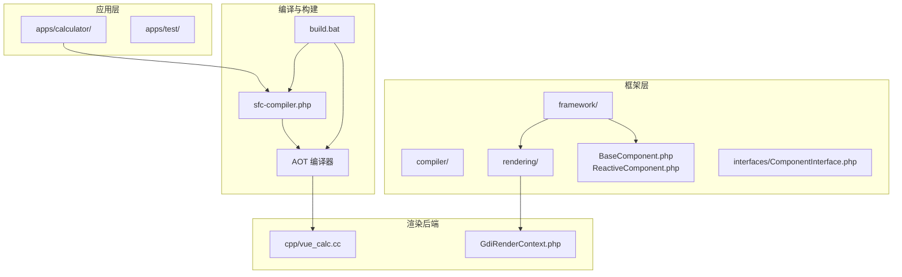
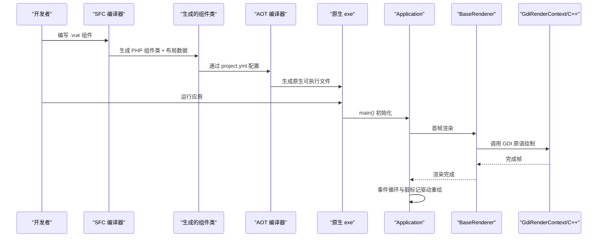
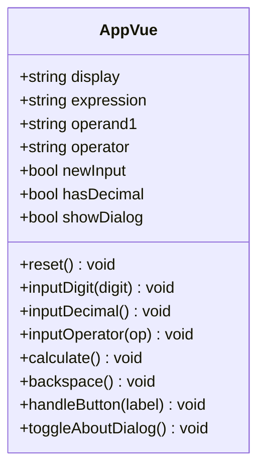
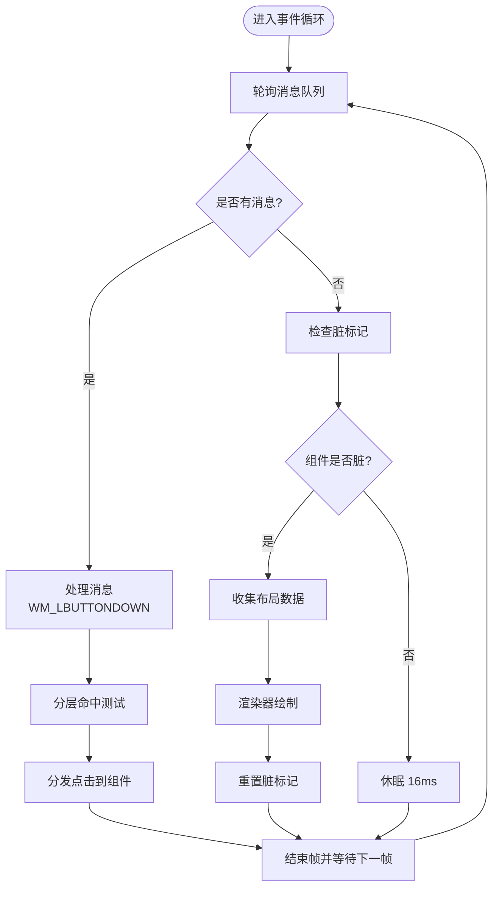
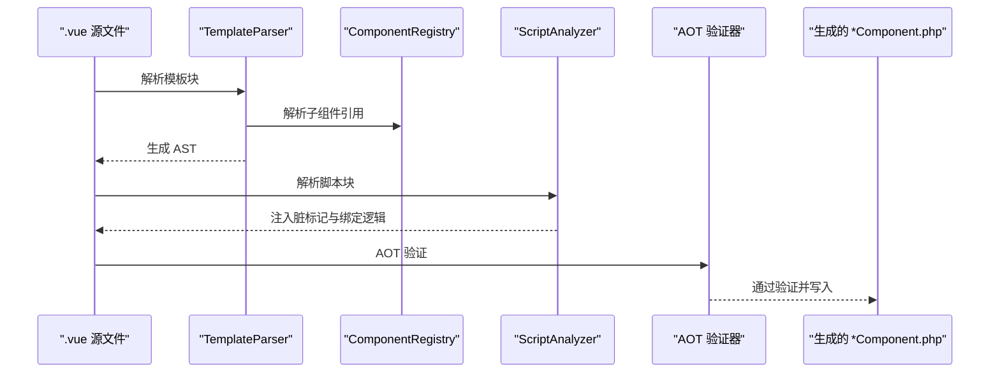
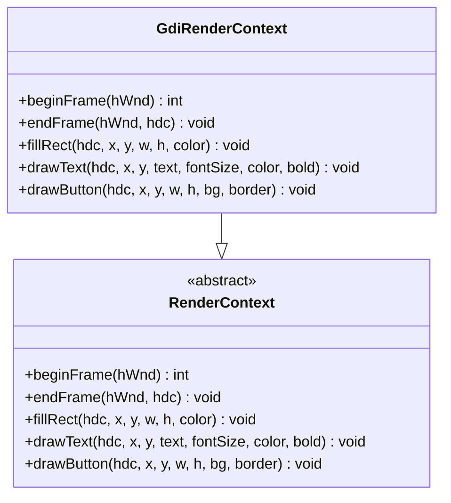
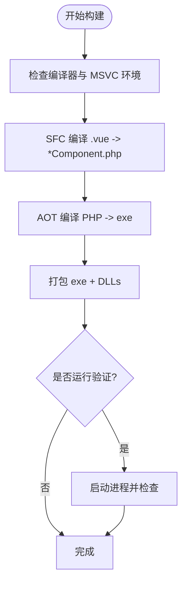
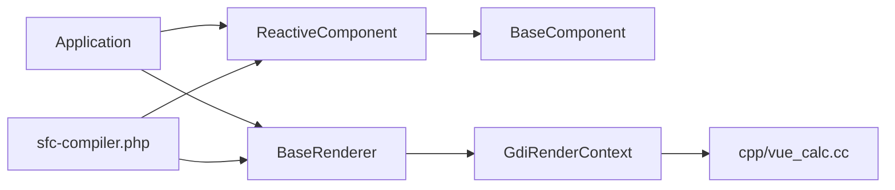

# 项目概述

<cite>
**本文档引用的文件**
- [apps/calculator/App.vue](file://apps/calculator/App.vue)
- [apps/calculator/Application.php](file://apps/calculator/Application.php)
- [apps/calculator/main.php](file://apps/calculator/main.php)
- [framework/sfc-compiler.php](file://framework/sfc-compiler.php)
- [framework/BaseComponent.php](file://framework/BaseComponent.php)
- [framework/ReactiveComponent.php](file://framework/ReactiveComponent.php)
- [framework/BaseRenderer.php](file://framework/BaseRenderer.php)
- [framework/rendering/GdiRenderContext.php](file://framework/rendering/GdiRenderContext.php)
- [framework/compiler/aot-validator.php](file://framework/compiler/aot-validator.php)
- [framework/compiler/template-parser.php](file://framework/compiler/template-parser.php)
- [cpp/vue_calc.cc](file://cpp/vue_calc.cc)
- [build.bat](file://build.bat)
- [docs/VueCalc技术文档_v2.html](file://docs/VueCalc技术文档_v2.html)
</cite>

## 目录
1. [简介](#简介)
2. [项目结构](#项目结构)
3. [核心组件](#核心组件)
4. [架构总览](#架构总览)
5. [详细组件分析](#详细组件分析)
6. [依赖关系分析](#依赖关系分析)
7. [性能考量](#性能考量)
8. [故障排查指南](#故障排查指南)
9. [结论](#结论)
10. [附录](#附录)

## 简介
VueCalc 是一个基于 PHP 的单文件组件（SFC）桌面应用程序框架，其独特之处在于将 Vue.js 风格的组件开发体验引入到桌面应用开发领域，并通过 AOT（提前编译）技术实现高性能的本地 GUI 应用。该项目以“数据驱动 UI = f(state)”为核心理念，前端使用 Vue 风格的模板语法描述界面，业务逻辑与状态管理由 PHP 实现，渲染层通过 C++ GDI 技术在 Windows 上高效呈现。

技术栈融合了：
- PHP：负责业务逻辑、状态管理与组件生命周期
- C++：封装 Win32 API 与 GDI 绘制原语，提供高性能渲染后端
- Windows GDI：实现双缓冲绘制、文本渲染与按钮绘制
- Swoole AOT 编译器：将 PHP 代码编译为原生可执行文件，消除运行时开销

AOT 的优势体现在：
- 预编译消除了 PHP 解释器的启动与执行成本
- 类型推断稳定，避免运行时动态分派带来的不确定性
- 生成原生二进制，启动更快、内存占用更低
- 适合资源受限的桌面环境，如嵌入式或轻量化计算器等场景

## 项目结构
项目采用按功能域划分的模块化组织方式，核心目录包括：
- apps：应用示例与入口，包含计算器应用与测试应用
- framework：框架核心，包含编译器、渲染器、组件基类与接口
- cpp：C++ 渲染后端，封装 Win32 API 与 GDI 绘制原语
- docs：技术文档与规划文档
- tests：编译器与布局验证测试
- 根目录：构建脚本与主构建入口

图表来源
- [apps/calculator/App.vue](file://apps/calculator/App.vue)
- [framework/sfc-compiler.php](file://framework/sfc-compiler.php)
- [framework/BaseComponent.php](file://framework/BaseComponent.php)
- [framework/rendering/GdiRenderContext.php](file://framework/rendering/GdiRenderContext.php)
- [cpp/vue_calc.cc](file://cpp/vue_calc.cc)
- [build.bat](file://build.bat)

章节来源
- [apps/calculator/App.vue](file://apps/calculator/App.vue)
- [apps/calculator/Application.php](file://apps/calculator/Application.php)
- [framework/sfc-compiler.php](file://framework/sfc-compiler.php)
- [framework/BaseComponent.php](file://framework/BaseComponent.php)
- [framework/rendering/GdiRenderContext.php](file://framework/rendering/GdiRenderContext.php)
- [cpp/vue_calc.cc](file://cpp/vue_calc.cc)
- [build.bat](file://build.bat)

## 核心组件
- 组件基类与响应式组件
  - BaseComponent：提供组件树结构、父子关系与属性管理
  - ReactiveComponent：继承 BaseComponent，增加脏标记与分组级脏状态，支持数据驱动渲染
- 应用控制器 Application
  - 负责窗口初始化、事件循环、点击分发与布局收集
  - 通过组件树递归收集布局数据并应用偏移，实现组件间相对定位
- 渲染器 BaseRenderer
  - 两阶段分层渲染：先确定最高活跃层，再按层渲染元素与按钮
  - 支持条件渲染与绑定值获取
- 渲染上下文 GdiRenderContext
  - 将渲染指令委托给 C++ 扩展的 GDI 原语，实现高性能绘制
- SFC 编译器
  - 解析 .vue 模板，生成 PHP 组件类与布局数据
  - 自动注入脏标记、条件求值与点击分发逻辑
- AOT 验证器
  - 在生成代码写盘前进行 AOT 兼容性检查，规避魔术方法、反射与动态调用等不兼容模式

章节来源
- [framework/BaseComponent.php](file://framework/BaseComponent.php)
- [framework/ReactiveComponent.php](file://framework/ReactiveComponent.php)
- [apps/calculator/Application.php](file://apps/calculator/Application.php)
- [framework/BaseRenderer.php](file://framework/BaseRenderer.php)
- [framework/rendering/GdiRenderContext.php](file://framework/rendering/GdiRenderContext.php)
- [framework/sfc-compiler.php](file://framework/sfc-compiler.php)
- [framework/compiler/aot-validator.php](file://framework/compiler/aot-validator.php)

## 架构总览
VueCalc 的整体架构遵循“模板 → 编译 → AOT → 原生执行”的流水线，核心流程如下：

图表来源
- [framework/sfc-compiler.php](file://framework/sfc-compiler.php)
- [apps/calculator/main.php](file://apps/calculator/main.php)
- [apps/calculator/Application.php](file://apps/calculator/Application.php)
- [framework/BaseRenderer.php](file://framework/BaseRenderer.php)
- [framework/rendering/GdiRenderContext.php](file://framework/rendering/GdiRenderContext.php)
- [cpp/vue_calc.cc](file://cpp/vue_calc.cc)

章节来源
- [framework/sfc-compiler.php](file://framework/sfc-compiler.php)
- [apps/calculator/main.php](file://apps/calculator/main.php)
- [apps/calculator/Application.php](file://apps/calculator/Application.php)
- [framework/BaseRenderer.php](file://framework/BaseRenderer.php)
- [framework/rendering/GdiRenderContext.php](file://framework/rendering/GdiRenderContext.php)
- [cpp/vue_calc.cc](file://cpp/vue_calc.cc)

## 详细组件分析

### 计算器应用组件 App.vue
- 模板结构
  - 根容器 app，尺寸固定，包含背景矩形、显示面板、表达式文本、数字键盘与关于按钮
  - 使用 v-if 控制弹窗显示，overlay 属性用于覆盖层渲染
- 业务逻辑
  - 状态字段：当前显示值、表达式、第一个操作数、当前运算符、输入状态、小数点状态
  - 方法：重置、输入数字、输入小数点、输入运算符、计算、退格、按钮点击处理、切换关于弹窗
- 样式与主题
  - 通过 CSS 类定义背景、文本与按钮样式，映射到 GDI 渲染属性

图表来源
- [apps/calculator/App.vue](file://apps/calculator/App.vue)

章节来源
- [apps/calculator/App.vue](file://apps/calculator/App.vue)

### 应用控制器 Application
- 窗口初始化与组件挂载
  - 创建窗口、显示窗口、挂载根组件及其子组件
  - 通过 getBaseComponents() 获取初始组件树，递归注册到活跃组件列表
- 事件循环与点击分发
  - 事件轮询与消息处理，鼠标点击坐标转换为组件坐标
  - 分层命中测试：先确定最高活跃层，再逆序命中测试，确保覆盖层优先
  - 将点击事件分发到根组件，触发相应业务方法
- 布局收集与渲染调度
  - 递归收集布局数据，应用累积偏移，生成元素与按钮数组
  - 仅在组件状态变更后触发渲染，实现数据驱动的最小化重绘

图表来源
- [apps/calculator/Application.php](file://apps/calculator/Application.php)
- [framework/BaseRenderer.php](file://framework/BaseRenderer.php)

章节来源
- [apps/calculator/Application.php](file://apps/calculator/Application.php)
- [framework/BaseRenderer.php](file://framework/BaseRenderer.php)

### SFC 编译器与 AOT 流水线
- 模板解析
  - 词法分析与递归下降解析，生成 AST
  - 支持自定义标签与属性绑定，收集 bindKeys、handlerMap、condProps
- 组件解析与注册
  - 解析子组件引用，生成 registerChildren 与 getBaseComponents
  - 应用坐标偏移与覆盖层层级，支持 v-if 条件渲染
- 代码生成与 AOT 验证
  - 生成 getLayout()、getBindValue()、dispatchClick()、evalCondition()
  - AOT 验证器检查变量属性访问、变量方法调用、PHP8 函数等不兼容模式
  - 生成的组件类写入 gen/ 目录，供 AOT 编译器消费

图表来源
- [framework/sfc-compiler.php](file://framework/sfc-compiler.php)
- [framework/compiler/template-parser.php](file://framework/compiler/template-parser.php)
- [framework/compiler/aot-validator.php](file://framework/compiler/aot-validator.php)

章节来源
- [framework/sfc-compiler.php](file://framework/sfc-compiler.php)
- [framework/compiler/template-parser.php](file://framework/compiler/template-parser.php)
- [framework/compiler/aot-validator.php](file://framework/compiler/aot-validator.php)

### 渲染后端：C++ GDI 与 PHP 扩展桥接
- C++ 封装
  - Win32 窗口与消息处理、双缓冲绘制、GDI 原语（填充矩形、绘制文本、绘制按钮）
- PHP 扩展桥接
  - GdiRenderContext 将渲染指令映射到 C++ 函数，实现跨语言调用
  - 渲染器通过 RenderContext 抽象层解耦具体绘制实现

图表来源
- [framework/rendering/GdiRenderContext.php](file://framework/rendering/GdiRenderContext.php)
- [cpp/vue_calc.cc](file://cpp/vue_calc.cc)

章节来源
- [framework/rendering/GdiRenderContext.php](file://framework/rendering/GdiRenderContext.php)
- [cpp/vue_calc.cc](file://cpp/vue_calc.cc)

### 构建与发布流程
- build.bat 脚本
  - 自动检测编译器与 MSVC 环境
  - 执行 SFC 编译、AOT 编译、打包与可选运行验证
  - 生成最终可执行文件与运行所需 DLL

图表来源
- [build.bat](file://build.bat)

章节来源
- [build.bat](file://build.bat)

## 依赖关系分析
- 组件层次
  - ReactiveComponent 继承 BaseComponent，扩展脏标记与分组级脏状态
  - Application 管理组件树与事件循环，委托渲染器进行绘制
  - BaseRenderer 通过 RenderContext 抽象与 GdiRenderContext 实现解耦
- 编译器依赖
  - sfc-compiler.php 依赖 TemplateParser、ComponentRegistry、CssMappings、ScriptAnalyzer、AotValidator
  - 生成的组件类依赖 ReactiveComponent 与 BaseComponent
- 渲染链路
  - PHP 侧：ReactiveComponent → BaseRenderer → GdiRenderContext
  - C++ 侧：GdiRenderContext → C++ 扩展 → Win32 GDI

图表来源
- [framework/ReactiveComponent.php](file://framework/ReactiveComponent.php)
- [framework/BaseComponent.php](file://framework/BaseComponent.php)
- [apps/calculator/Application.php](file://apps/calculator/Application.php)
- [framework/BaseRenderer.php](file://framework/BaseRenderer.php)
- [framework/rendering/GdiRenderContext.php](file://framework/rendering/GdiRenderContext.php)
- [cpp/vue_calc.cc](file://cpp/vue_calc.cc)
- [framework/sfc-compiler.php](file://framework/sfc-compiler.php)

章节来源
- [framework/ReactiveComponent.php](file://framework/ReactiveComponent.php)
- [framework/BaseComponent.php](file://framework/BaseComponent.php)
- [apps/calculator/Application.php](file://apps/calculator/Application.php)
- [framework/BaseRenderer.php](file://framework/BaseRenderer.php)
- [framework/rendering/GdiRenderContext.php](file://framework/rendering/GdiRenderContext.php)
- [cpp/vue_calc.cc](file://cpp/vue_calc.cc)
- [framework/sfc-compiler.php](file://framework/sfc-compiler.php)

## 性能考量
- AOT 编译优势
  - 预编译消除解释器开销，启动更快、运行更稳
  - 类型推断稳定，避免动态分派导致的性能波动
- 渲染优化
  - 两阶段分层渲染减少无效绘制，仅在脏标记触发时重绘
  - 文本渲染根据长度动态调整字号，提升可读性与性能平衡
  - 双缓冲绘制避免闪烁，提高视觉流畅度
- 组件树与布局
  - 递归收集布局数据时应用累积偏移，避免重复计算
  - 条件渲染与覆盖层机制减少不必要的绘制项

[本节为通用性能讨论，无需列出章节来源]

## 故障排查指南
- AOT 验证失败
  - 症状：生成文件未写入或 AOT 报错
  - 常见原因：变量属性访问、变量方法调用、PHP8 函数、顶层可执行语句
  - 处理：遵循 AOT 约束，使用显式 if/else 或函数调用，避免魔术方法与反射
- 构建失败
  - 症状：build.bat 返回非零错误码
  - 常见原因：MSVC 未就绪、编译器路径错误、缺少 php8embed.lib
  - 处理：在 Developer Command Prompt for VS 中运行，确保编译器与依赖库可用
- 渲染异常
  - 症状：窗口无绘制或绘制错位
  - 常见原因：布局数据未正确应用偏移、条件表达式求值错误
  - 处理：检查 v-if 条件与组件偏移，确认 evalCondition 逻辑

章节来源
- [framework/compiler/aot-validator.php](file://framework/compiler/aot-validator.php)
- [build.bat](file://build.bat)
- [framework/BaseRenderer.php](file://framework/BaseRenderer.php)

## 结论
VueCalc 通过将 Vue 风格的组件开发体验与 AOT 编译技术相结合，为桌面应用开发提供了新的思路：以数据驱动的方式描述 UI，以 PHP 实现业务逻辑，以 C++ GDI 提供高性能渲染。该框架在保证易用性的同时，兼顾了性能与稳定性，适用于计算器、工具类等对启动速度与资源占用敏感的应用场景。随着迭代的推进，框架在组件系统、响应式机制与渲染能力方面持续完善，为构建更复杂桌面应用奠定了坚实基础。

[本节为总结性内容，无需列出章节来源]

## 附录
- 技术文档参考
  - VueCalc 技术文档 v2：涵盖构建管道、AOT 约束与设计演进
- 相关文件
  - 项目入口与应用示例：apps/calculator/main.php、App.vue
  - 框架核心：framework/* 与 cpp/vue_calc.cc
  - 构建脚本：build.bat

章节来源
- [docs/VueCalc技术文档_v2.html](file://docs/VueCalc技术文档_v2.html)
- [apps/calculator/main.php](file://apps/calculator/main.php)
- [apps/calculator/App.vue](file://apps/calculator/App.vue)
- [framework/sfc-compiler.php](file://framework/sfc-compiler.php)
- [cpp/vue_calc.cc](file://cpp/vue_calc.cc)
- [build.bat](file://build.bat)